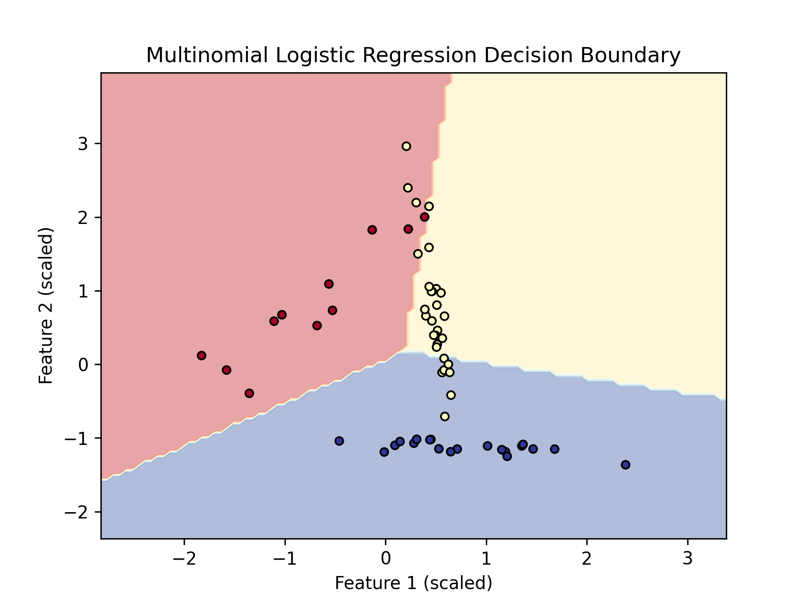

# Regression

- [Regression](#regression)
  - [Linear Regression](#linear-regression)
    - [1. Data Representation](#1-data-representation)
    - [2. Model Representation](#2-model-representation)
    - [3. Learning (as Optimization)](#3-learning-as-optimization)
      - [a. Closed-form Solution (Normal Equation)](#a-closed-form-solution-normal-equation)
      - [b. Iterative Optimization Algorithms (Gradient Descent)](#b-iterative-optimization-algorithms-gradient-descent)
        - [I. Batch Gradient Descent (BGD)](#i-batch-gradient-descent-bgd)
        - [II. Stochastic Gradient Descent (SGD)](#ii-stochastic-gradient-descent-sgd)
        - [III. Mini-batch Stochastic Gradient Descent (Mini-batch SGD)](#iii-mini-batch-stochastic-gradient-descent-mini-batch-sgd)
    - [4. Why MSE (Mean Squared Error)?](#4-why-mse-mean-squared-error)
    - [5. Bias-Variance Tradeoff ☕️](#5-bias-variance-tradeoff-️)
      - [Overfitting and Underfitting](#overfitting-and-underfitting)
    - [6. Regularization ☕️](#6-regularization-️)
      - [a. Ridge Regression (L2 Regularization)](#a-ridge-regression-l2-regularization)
      - [b. Lasso Regression (L1 Regularization)](#b-lasso-regression-l1-regularization)
      - [c. Connection to MLE and MAP (Maximum A Posteriori)](#c-connection-to-mle-and-map-maximum-a-posteriori)
    - [8. Polynomial Regression](#8-polynomial-regression)
      - [Is Polynomial Regression Linear or Non-linear? A Dialectical View](#is-polynomial-regression-linear-or-non-linear-a-dialectical-view)
    - [Appendix: PyTorch Linear Regression Example with Different Batching Strategies](#appendix-pytorch-linear-regression-example-with-different-batching-strategies)
  - [Logistic Regression](#logistic-regression)
    - [1. Relationship to Linear Regression](#1-relationship-to-linear-regression)
    - [2. Logit, Logistic, and Regression Explained](#2-logit-logistic-and-regression-explained)
    - [3. Sigmoid (Logistic) for Binary Classification and Softmax for Multi-class](#3-sigmoid-logistic-for-binary-classification-and-softmax-for-multi-class)
      - [a. Sigmoid (Logistic) Function](#a-sigmoid-logistic-function)
      - [b. Softmax Function (for Multi-class Classification)](#b-softmax-function-for-multi-class-classification)
    - [4. Data and Model Representation](#4-data-and-model-representation)
      - [a. Data Representation (for Classification)](#a-data-representation-for-classification)
      - [b. Logistic Regression Model (Binary Classification)](#b-logistic-regression-model-binary-classification)
      - [c. Softmax Regression Model (Multinomial Logistic Regression)](#c-softmax-regression-model-multinomial-logistic-regression)
    - [4. Learning](#4-learning)
      - [Probabilistic Motivation (Maximum Likelihood Estimation - MLE)](#probabilistic-motivation-maximum-likelihood-estimation---mle)
      - [Gradient of the Cross-Entropy Cost Function](#gradient-of-the-cross-entropy-cost-function)
      - [Cross-Entropy for Multi-class Classification (with Softmax)](#cross-entropy-for-multi-class-classification-with-softmax)
    - [5. Criterion on Classification (Evaluation Metrics)](#5-criterion-on-classification-evaluation-metrics)
    - [Appendix: PyTorch Logistic Regression Examples](#appendix-pytorch-logistic-regression-examples)
      - [1. Binary Logistic Regression Example (with Sigmoid)](#1-binary-logistic-regression-example-with-sigmoid)
      - [2. Multinomial Logistic Regression Example (Softmax Regression)](#2-multinomial-logistic-regression-example-softmax-regression)

Regression analysis is a cornerstone of supervised machine learning and statistics. Its primary goal is to model the relationship between a dependent variable (target) and one or more independent variables (features or predictors).

## Linear Regression

Linear Regression is one of the simplest and most widely used regression algorithms. It assumes a linear relationship between the input features and the continuous target variable. Despite its simplicity, it's a powerful tool for prediction and understanding feature importance.

### 1. Data Representation

Let's define our notation:
-   $m$: Number of training examples (samples).
-   $n$: Number of features (dimensionality of input).
-   $\mathbf{X}$: Input features matrix of shape $(m, n)$. Each row $\mathbf{x}^{(i)}$ is a training example (as a row vector), and each column $\mathbf{x}_j$ represents a feature.
    $$
    \mathbf{X} = \begin{pmatrix}
    x_1^{(1)} & x_2^{(1)} & \dots & x_n^{(1)} \\
    x_1^{(2)} & x_2^{(2)} & \dots & x_n^{(2)} \\
    \vdots & \vdots & \ddots & \vdots \\
    x_1^{(m)} & x_2^{(m)} & \dots & x_n^{(m)}
    \end{pmatrix}
    $$
-   $\mathbf{y}$: Target variable vector of shape $(m, 1)$. Each element $y^{(i)}$ is the true output for the $i$-th training example.
    $$
    \mathbf{y} = \begin{pmatrix} y^{(1)} \\ y^{(2)} \\ \vdots \\ y^{(m)} \end{pmatrix}
    $$
-   $\mathbf{x}^{(i)}$: The feature vector for the $i$-th training example. If we consider it as a column vector for matrix operations: $\mathbf{x}^{(i)} = [x_1^{(i)}, x_2^{(i)}, \dots, x_n^{(i)}]^T$.
-   $x_j^{(i)}$: The value of the $j$-th feature in the $i$-th training example.

<!-- To incorporate an intercept term (bias) $\theta_0$ into our model conveniently, we often augment the feature matrix $\mathbf{X}$ by prepending a column of ones. This makes $x_0^{(i)} = 1$ for all $i$. The augmented $\mathbf{X}$ then has shape $(m, n+1)$, and $\mathbf{x}^{(i)}$ becomes an $(n+1)$-dimensional column vector $\mathbf{x}^{(i)} = [x_0^{(i)}, x_1^{(i)}, \dots, x_n^{(i)}]^T = [1, x_1^{(i)}, \dots, x_n^{(i)}]^T$.

*Different usage of the term "Bias" in stats/machine learning

- https://stats.stackexchange.com/questions/511726/different-usage-of-the-term-bias-in-stats-machine-learning
- https://stats.stackexchange.com/questions/599593/whats-in-a-name-bias-intercept -->

$$
\mathbf{X}_{aug} = \begin{pmatrix}
1 & x_1^{(1)} & x_2^{(1)} & \dots & x_n^{(1)} \\
1 & x_1^{(2)} & x_2^{(2)} & \dots & x_n^{(2)} \\
\vdots & \vdots & \vdots & \ddots & \vdots \\
1 & x_1^{(m)} & x_2^{(m)} & \dots & x_n^{(m)}
\end{pmatrix}
$$

### 2. Model Representation

The linear regression model hypothesizes that the target variable $y$ can be approximated by a linear combination of the input features $\mathbf{x}$ and a set of parameters $\mathbf{\theta}$ (also called weights or coefficients).

For a single training example $\mathbf{x}^{(i)}$ (an $(n+1)$-dimensional column vector including $x_0^{(i)}=1$), the model's prediction (hypothesis) $h_\theta(\mathbf{x}^{(i)})$ is:

$h_\theta(\mathbf{x}^{(i)}) = \theta_0 x_0^{(i)} + \theta_1 x_1^{(i)} + \dots + \theta_n x_n^{(i)} = \mathbf{\theta}^T \mathbf{x}^{(i)}$

Where:
-   $\mathbf{\theta} = [\theta_0, \theta_1, \dots, \theta_n]^T$ is the $(n+1)$-dimensional parameter column vector.
-   $\theta_0$ is the intercept (bias) term.
-   $\theta_1, \dots, \theta_n$ are the coefficients for the respective features.

In vectorized form for all training examples:

$$
\hat{\mathbf{y}} = \mathbf{X}\mathbf{\theta}
$$

Where $\hat{\mathbf{y}}$ is an $(m, 1)$ vector of predictions, $\mathbf{X}$ is the $(m, n+1)$ augmented feature matrix (each row is $(\mathbf{x}^{(i)})^T$ with $x_0^{(i)}=1$), and $\mathbf{\theta}$ is the $(n+1, 1)$ parameter vector.

### 3. Learning (as Optimization)

The "learning" process involves finding the optimal parameter vector $\mathbf{\theta}$ that minimizes the difference between the predicted values $\hat{\mathbf{y}}$ and the actual values $\mathbf{y}$. This is typically formulated as minimizing a **cost function** (or loss function). For linear regression, the most common cost function is the **Mean Squared Error (MSE)**.

**Cost Function $J(\mathbf{\theta})$ (MSE):**
$$ J(\mathbf{\theta}) = \frac{1}{2m} \sum_{i=1}^{m} (h_\theta(\mathbf{x}^{(i)}) - y^{(i)})^2 $$

The $\frac{1}{2m}$ term:
-   $\frac{1}{m}$: Averages the squared error over all training examples.
-   $\frac{1}{2}$: Is a convenience factor for simplifying the derivative calculation in Gradient Descent. It doesn't change the location of the minimum.

In vectorized form:
$$ J(\mathbf{\theta}) = \frac{1}{2m} (\mathbf{X}\mathbf{\theta} - \mathbf{y})^T (\mathbf{X}\mathbf{\theta} - \mathbf{y}) $$

There are several ways to find the $\mathbf{\theta}$ that minimizes $J(\mathbf{\theta})$:

#### a. Closed-form Solution (Normal Equation)

For linear regression with MSE, there's a direct analytical solution. We can find $\mathbf{\theta}$ by setting the gradient of $J(\mathbf{\theta})$ with respect to $\mathbf{\theta}$ to zero and solving for $\mathbf{\theta}$:

$$ \nabla_\theta J(\mathbf{\theta}) = \nabla_\theta \left[ \frac{1}{2m} (\mathbf{X}\mathbf{\theta} - \mathbf{y})^T (\mathbf{X}\mathbf{\theta} - \mathbf{y}) \right] = \frac{1}{m} \mathbf{X}^T (\mathbf{X}\mathbf{\theta} - \mathbf{y}) $$

Setting $\nabla_\theta J(\mathbf{\theta}) = \mathbf{0}$:
$$ \mathbf{X}^T (\mathbf{X}\mathbf{\theta} - \mathbf{y}) = \mathbf{0} $$
$$ \mathbf{X}^T \mathbf{X}\mathbf{\theta} - \mathbf{X}^T \mathbf{y} = \mathbf{0} $$
$$ \mathbf{X}^T \mathbf{X}\mathbf{\theta} = \mathbf{X}^T \mathbf{y} $$
$$ \mathbf{\theta} = (\mathbf{X}^T \mathbf{X})^{-1} \mathbf{X}^T \mathbf{y} $$

This is known as the **Normal Equation**.

-   **Conditions:** This solution requires $\mathbf{X}^T \mathbf{X}$ to be invertible. This is usually true if features are linearly independent and $m \ge n+1$ (more examples than features). If $\mathbf{X}^T \mathbf{X}$ is non-invertible (singular), common causes include:
    -   Redundant features (linear dependency, e.g., $x_1 = 2x_2$).
    -   Too many features ($m < n+1$). Regularization can help here.
-   **Time Complexity:**
    -   Calculating $\mathbf{X}^T\mathbf{X}$: $O(n^2m)$ (if $n$ is features including intercept).
    -   Inverting $(\mathbf{X}^T\mathbf{X})$ (an $(n+1) \times (n+1)$ matrix): Typically $O(n^3)$ using methods like Gaussian elimination or LU decomposition.
    -   Calculating $\mathbf{X}^T\mathbf{y}$: $O(nm)$.
    -   Final multiplication: $O(n^2)$.
    The dominant step is the matrix inversion $O(n^3)$. This method is efficient for small $n$ (e.g., $n < 10,000$) but becomes slow for very large numbers of features.
-   **Pros:** No need to choose a learning rate, no iterations, direct solution.
-   **Cons:** Computationally expensive for large $n$. $\mathbf{X}^T\mathbf{X}$ might be non-invertible.

#### b. Iterative Optimization Algorithms (Gradient Descent)

Alternatively, iterative optimization algorithms based on Gradient Descent are widely used, especially for larger datasets or models where a closed-form solution is not available (like in neural networks).

Gradient Descent is a family of **first-order iterative optimization algorithms for finding a local minimum of a differentiable function**. The core idea is to iteratively take steps in the direction opposite to the gradient (or approximate gradient) of the function at the current point, as this is the direction of steepest descent.

The general update rule for parameters $\mathbf{\theta}$ is:
$$ \mathbf{\theta} := \mathbf{\theta} - \alpha \nabla J(\mathbf{\theta}) $$
Where:
-   $\mathbf{\theta}$ is the vector of parameters to be updated.
-   $\alpha$ is the **learning rate**, a scalar hyperparameter that controls the step size.
-   $\nabla J(\mathbf{\theta})$ is the gradient of the cost function $J$ with respect to $\mathbf{\theta}$.

There are three main variants of Gradient Descent, differing in how much data is used to compute the gradient at each step:

##### I. Batch Gradient Descent (BGD)

-   **Motivation:**
    Batch Gradient Descent aims for a precise and stable update by considering the entire dataset. It computes the gradient of the cost function with respect to the parameters $\mathbf{\theta}$ using all $m$ training examples. This provides an accurate estimate of the true gradient for the current parameter values. For convex cost functions like MSE in linear regression, BGD is guaranteed to converge to the global minimum (if the learning rate is chosen appropriately).

-   **Pipeline/Algorithm:**
    1.  Initialize parameters $\mathbf{\theta}$ (e.g., randomly or to zeros).
    2.  Repeat until convergence (or for a fixed number of epochs):
        a.  Compute the gradient $\nabla J(\mathbf{\theta})$ using *all* $m$ training examples. For MSE, this is:
            $$ \nabla J(\mathbf{\theta}) = \frac{1}{m} \mathbf{X}^T (\mathbf{X}\mathbf{\theta} - \mathbf{y}) $$
            (Note: $\nabla J(\mathbf{\theta})$ here means the gradient of the *average* loss over the batch).
        b.  Update the parameters:
            $$ \mathbf{\theta} := \mathbf{\theta} - \alpha \nabla J(\mathbf{\theta}) $$

-   **Pros:**
    -   The gradient calculated is the true gradient of the entire dataset, leading to a smooth and stable convergence path (less oscillation).
    -   Deterministic parameter updates for a fixed learning rate.
    -   Guaranteed convergence to the global minimum for convex loss functions and to a local minimum for non-convex functions.

-   **Cons:**
    -   Computationally very expensive for large datasets, as it requires processing all training examples for a single update. The entire dataset must fit in memory.
    -   Cannot be used for online learning (where data arrives sequentially).
    -   Can be slow if the dataset is massive.

-   **PyTorch Implementation:**
    In PyTorch, BGD is achieved by performing a forward pass and backward pass on the entire dataset before calling `optimizer.step()`.
    ```python
    # Assuming X_all and y_all are tensors for the entire dataset
    # model, criterion, optimizer are defined

    # Single BGD step
    predictions = model(X_all)
    loss = criterion(predictions, y_all)
    optimizer.zero_grad()
    loss.backward()
    optimizer.step()
    ```
    A PyTorch `DataLoader` with `batch_size=len(dataset)` would effectively simulate BGD for one epoch if the loop iterates only once over the dataloader.

##### II. Stochastic Gradient Descent (SGD)

-   **Motivation:**
    SGD was introduced to address the computational burden of BGD, especially for very large datasets. Instead of using the entire dataset, SGD updates the parameters based on the gradient computed from a *single* randomly selected training example (or sometimes a very small number of examples, though "pure" SGD is often taken as one example). This makes each update much faster.

-   **Pipeline/Algorithm:**
    1.  Initialize parameters $\mathbf{\theta}$.
    2.  Repeat for a specified number of epochs:
        a.  (Crucial) Randomly shuffle the training dataset $(\mathbf{X}, \mathbf{y})$.
        b.  For each training example $(\mathbf{x}^{(i)}, y^{(i)})$ in the shuffled dataset:
            i.  Compute the gradient $\nabla J_i(\mathbf{\theta})$ of the cost function with respect to $\mathbf{\theta}$ using *only* this single example $(\mathbf{x}^{(i)}, y^{(i)})$. For MSE and example $i$:
                $$ \nabla J_i(\mathbf{\theta}) = (\mathbf{X}^{(i)}\mathbf{\theta} - y^{(i)}) (\mathbf{x}^{(i)})^T $$
                (Note: This is the gradient for the loss of a single instance, not averaged).
            ii. Update the parameters:
                $$ \mathbf{\theta} := \mathbf{\theta} - \alpha \nabla J_i(\mathbf{\theta}) $$

-   **Pros:**
    -   Significantly faster parameter updates, as only one example is processed per update.
    -   Can handle very large datasets that don't fit in memory (can be used for online learning).
    -   The "noisy" updates can help escape shallow local minima in non-convex problems.

-   **Cons:**
    -   High variance in parameter updates due to the use of single examples. The cost function can fluctuate significantly, making the convergence path noisy.
    -   May not converge to the exact minimum but will typically oscillate around it.
    -   Requires careful tuning of the learning rate $\alpha$. Often, a learning rate schedule (decaying $\alpha$ over time) is needed for better convergence.

-   **PyTorch Implementation:**
    Using `torch.optim.SGD` with a `DataLoader` that yields batches of size 1 effectively implements SGD.
    ```python
    from torch.utils.data import TensorDataset, DataLoader
    dataset = TensorDataset(X_tensor, y_tensor)
    sgd_dataloader = DataLoader(dataset, batch_size=1, shuffle=True)
    model, criterion, optimizer (e.g., optim.SGD) are defined
    
    for epoch in range(num_epochs):
        for inputs_i, targets_i in sgd_dataloader: # inputs_i is a single sample
            predictions = model(inputs_i)
            loss = criterion(predictions, targets_i)
            optimizer.zero_grad()
            loss.backward()
            optimizer.step()
    ```

##### III. Mini-batch Stochastic Gradient Descent (Mini-batch SGD)

-   **Motivation:**
    Mini-batch SGD is a compromise between the stability of BGD and the efficiency of SGD. It updates parameters using a small, randomly selected subset (a "mini-batch") of training examples. This approach strikes a balance:
    -   It reduces the variance of parameter updates compared to SGD, leading to more stable convergence.
    -   It is computationally more efficient than BGD because not all data is processed for each update.
    -   It can leverage modern hardware (GPUs/TPUs) effectively through vectorized operations on mini-batches, which is often faster than processing single examples serially (SGD) or one massive batch (BGD).

-   **Pipeline/Algorithm:**
    1.  Initialize parameters $\mathbf{\theta}$.
    2.  Repeat for a specified number of epochs:
        a.  (Crucial) Randomly shuffle the training dataset $(\mathbf{X}, \mathbf{y})$.
        b.  Divide the dataset into mini-batches of a chosen size `b` (e.g., 32, 64, 128).
        c.  For each mini-batch $(\mathbf{X}_{\text{batch}}, \mathbf{y}_{\text{batch}})$:
            i.  Compute the gradient $\nabla J_{\text{batch}}(\mathbf{\theta})$ of the cost function using only the examples in the current mini-batch. For MSE, this is:
                $$ \nabla J_{\text{batch}}(\mathbf{\theta}) = \frac{1}{b} \mathbf{X}_{\text{batch}}^T (\mathbf{X}_{\text{batch}}\mathbf{\theta} - \mathbf{y}_{\text{batch}}) $$
            ii. Update the parameters:
                $$ \mathbf{\theta} := \mathbf{\theta} - \alpha \nabla J_{\text{batch}}(\mathbf{\theta}) $$

-   **Pros:**
    -   Offers a good balance between the stability of BGD and the speed/efficiency of SGD.
    -   Allows for efficient computation through vectorized operations on mini-batches, fully utilizing modern hardware.
    -   The most common gradient descent variant used for training deep neural networks.
    -   Smoother convergence than SGD.

-   **Cons:**
    -   Introduces an additional hyperparameter: the mini-batch size `b`. The optimal batch size can be data/model dependent.
    -   Performance can be sensitive to the batch size.

-   **PyTorch Implementation:**
    This is the standard way PyTorch optimizers (like `optim.SGD`, `optim.Adam`, etc.) are used in conjunction with `torch.utils.data.DataLoader`.
    ```python
    from torch.utils.data import TensorDataset, DataLoader
    BATCH_SIZE = 32 # Example mini-batch size
    dataset = TensorDataset(X_tensor, y_tensor)
    minibatch_dataloader = DataLoader(dataset, batch_size=BATCH_SIZE, shuffle=True)
    model, criterion, optimizer are defined
    
    for epoch in range(num_epochs):
        for inputs_batch, targets_batch in minibatch_dataloader:
            predictions = model(inputs_batch)
            loss = criterion(predictions, targets_batch)
            optimizer.zero_grad()
            loss.backward()
            optimizer.step()
    ```

### 4. Why MSE (Mean Squared Error)?

MSE is a popular choice for several reasons:
1.  **Mathematical Convenience:** The squared term makes the cost function differentiable and convex, ensuring a single global minimum. Its derivative is linear, simplifying calculations for Normal Equation and Gradient Descent.
2.  **Penalizes Larger Errors More:** Squaring the error $(h_\theta(\mathbf{x}^{(i)}) - y^{(i)})$ means larger deviations are penalized more significantly than smaller ones.
3.  **Probabilistic Interpretation (Maximum Likelihood Estimation - MLE):**
    If we assume that the errors $\epsilon^{(i)} = y^{(i)} - h_\theta(\mathbf{x}^{(i)})$ are **Independent and Identically Distributed (IID)** according to a **Gaussian (Normal) distribution** with mean $0$ and variance $\sigma^2$ (i.e., $\epsilon^{(i)} \sim \mathcal{N}(0, \sigma^2)$), then:
    $$ P(y^{(i)} | \mathbf{x}^{(i)}; \mathbf{\theta}) = \frac{1}{\sqrt{2\pi}\sigma} \exp\left(-\frac{(y^{(i)} - \mathbf{\theta}^T\mathbf{x}^{(i)})^2}{2\sigma^2}\right) $$
    The likelihood of observing the entire dataset $\mathbf{y}$ given $\mathbf{X}$ and $\mathbf{\theta}$ is:
    $$ L(\mathbf{\theta}) = \prod_{i=1}^{m} P(y^{(i)} | \mathbf{x}^{(i)}; \mathbf{\theta}) $$
    The log-likelihood is:
    $$ \ell(\mathbf{\theta}) = \log L(\mathbf{\theta}) = \sum_{i=1}^{m} \log P(y^{(i)} | \mathbf{x}^{(i)}; \mathbf{\theta}) $$
    $$ \ell(\mathbf{\theta}) = \sum_{i=1}^{m} \left[ \log\left(\frac{1}{\sqrt{2\pi}\sigma}\right) - \frac{(y^{(i)} - \mathbf{\theta}^T\mathbf{x}^{(i)})^2}{2\sigma^2} \right] $$
    $$ \ell(\mathbf{\theta}) = m \log\left(\frac{1}{\sqrt{2\pi}\sigma}\right) - \frac{1}{2\sigma^2} \sum_{i=1}^{m} (y^{(i)} - \mathbf{\theta}^T\mathbf{x}^{(i)})^2 $$
    To find the $\mathbf{\theta}$ that maximizes $\ell(\mathbf{\theta})$ (Maximum Likelihood Estimate), we need to minimize the term $\sum_{i=1}^{m} (y^{(i)} - \mathbf{\theta}^T\mathbf{x}^{(i)})^2$, which is equivalent to minimizing MSE.
    Thus, under the assumption of IID Gaussian errors, minimizing MSE is equivalent to finding the MLE for $\mathbf{\theta}$.

### 5. Bias-Variance Tradeoff ☕️

The generalization error of a model can be decomposed into bias, variance, and irreducible error.
-   **Bias:** The error introduced by approximating a real-life problem (which may be complex) by a much simpler model. High bias means the model is too simple and systematically misses the true relationship (underfitting). Linear regression can have high bias if the true relationship is non-linear.
-   **Variance:** The amount by which the learned model $h_\theta$ would change if we trained it on a different training dataset. High variance means the model is too complex and captures noise in the training data (overfitting). Linear regression can have high variance if there are many features, multicollinearity, or small $m$.
-   **Irreducible Error (Noise):** The error that cannot be reduced by any model, due to inherent randomness or unmeasured variables.

**Tradeoff:**
-   Simple models (like basic linear regression with few features) tend to have **high bias** and **low variance**.
-   Complex models (like high-degree polynomial regression or linear regression with many features) tend to have **low bias** and **high variance**.
The goal is to find a model that balances bias and variance to achieve the lowest total error on unseen data.

#### Overfitting and Underfitting
-   **Underfitting (High Bias):** The model is too simple to capture the underlying structure of the data. It performs poorly on both the training set and the test set.
    *Example:* Trying to fit a linear line to data that has a clear quadratic trend.
-   **Overfitting (High Variance):** The model learns the training data too well, including its noise and random fluctuations. It performs very well on the training set but poorly on the unseen test set.
    *Example:* Fitting a very high-degree polynomial to a small, noisy dataset.

(Visual Intuition: Imagine plots showing: 1. A line underfitting a curve. 2. A line fitting a linear trend well. 3. A wiggly curve overfitting noisy linear-ish data.)

### 6. Regularization ☕️

Regularization techniques are used to prevent overfitting by adding a penalty term to the cost function for large parameter values. This discourages the model from becoming too complex.

The general regularized cost function:
$$ J_{reg}(\mathbf{\theta}) = J_{MSE}(\mathbf{\theta}) + \lambda P(\mathbf{\theta}) $$
Where $J_{MSE}(\mathbf{\theta})$ is the original MSE cost function, $\lambda \ge 0$ is the **regularization parameter** (hyperparameter controlling the strength of the penalty), and $P(\mathbf{\theta})$ is the penalty term.
Conventionally, the bias term $\theta_0$ is not regularized.

#### a. Ridge Regression (L2 Regularization)

-   **Penalty Term:** $P(\mathbf{\theta}) = \sum_{j=1}^{n} \theta_j^2 = ||\mathbf{\theta}_{1:n}||_2^2$ (sum of squared parameter values, excluding $\theta_0$).
-   **Cost Function:**
    $$ J_{Ridge}(\mathbf{\theta}) = \frac{1}{2m} \sum_{i=1}^{m} (h_\theta(\mathbf{x}^{(i)}) - y^{(i)})^2 + \frac{\lambda}{2m} \sum_{j=1}^{n} \theta_j^2 $$
    (The $\frac{1}{2m}$ factor for $\lambda$ is common to keep scaling consistent with MSE term, though sometimes $\frac{\lambda}{2}$ or $\lambda$ is used directly with the sum of squares).
-   **Effect:** Shrinks coefficients $\theta_j$ towards zero. It doesn't set them exactly to zero unless $\lambda$ is infinitely large. Useful when dealing with multicollinearity (highly correlated features).
-   **Closed-form Solution (Ridge):**
    $$ \mathbf{\theta} = (\mathbf{X}^T\mathbf{X} + \lambda \mathbf{I}')^{-1} \mathbf{X}^T \mathbf{y} $$
    Where $\mathbf{I}'$ is an $(n+1) \times (n+1)$ identity matrix with the top-left element $I'_{0,0}=0$ (to not regularize $\theta_0$). If $\theta_0$ is not part of $\mathbf{X}$ (i.e., $\mathbf{X}$ is $(m,n)$ and $\theta_0$ handled separately), then $\mathbf{I}$ is $n \times n$. Adding $\lambda\mathbf{I}'$ makes $\mathbf{X}^T\mathbf{X} + \lambda\mathbf{I}'$ more likely to be invertible.
-   **Gradient Descent Update (for $j > 0$):**
    $$ \frac{\partial J_{Ridge}(\mathbf{\theta})}{\partial \theta_j} = \left( \frac{1}{m} \sum_{i=1}^{m} (h_\theta(\mathbf{x}^{(i)}) - y^{(i)})x_j^{(i)} \right) + \frac{\lambda}{m}\theta_j $$
    So,
    $$ \theta_j := \theta_j - \alpha \left[ \left( \frac{1}{m} \sum_{i=1}^{m} (h_\theta(\mathbf{x}^{(i)}) - y^{(i)})x_j^{(i)} \right) + \frac{\lambda}{m}\theta_j \right] $$
    $$ \theta_j := \theta_j(1 - \alpha\frac{\lambda}{m}) - \alpha \frac{1}{m} \sum_{i=1}^{m} (h_\theta(\mathbf{x}^{(i)}) - y^{(i)})x_j^{(i)} \quad (\text{This shows weight decay}) $$
    For $\theta_0$, the update is without the regularization term.

#### b. Lasso Regression (L1 Regularization)

-   **Penalty Term:** $P(\mathbf{\theta}) = \sum_{j=1}^{n} |\theta_j| = ||\mathbf{\theta}_{1:n}||_1$ (sum of absolute parameter values, excluding $\theta_0$).
-   **Cost Function:**
    $$ J_{Lasso}(\mathbf{\theta}) = \frac{1}{2m} \sum_{i=1}^{m} (h_\theta(\mathbf{x}^{(i)}) - y^{(i)})^2 + \frac{\lambda}{m} \sum_{j=1}^{n} |\theta_j| $$
-   **Effect:** Shrinks coefficients $\theta_j$ towards zero and can set some coefficients *exactly* to zero. This makes Lasso useful for automatic **feature selection**.
-   **Solving Lasso:**
    -   No simple closed-form solution because the L1 penalty $|\theta_j|$ is not differentiable at $\theta_j=0$.
    -   Requires iterative optimization algorithms like Coordinate Descent, LARS (Least Angle Regression), or proximal gradient methods (e.g., ISTA, FISTA).
    -   For Gradient Descent-like methods, use a subgradient for the L1 term:
        $$ \frac{\partial|\theta_j|}{\partial\theta_j} = \text{sgn}(\theta_j) \quad \text{if } \theta_j \neq 0 $$
        The subdifferential at $\theta_j=0$ is the interval $[-1, 1]$.

#### c. Connection to MLE and MAP (Maximum A Posteriori)

Regularization can be interpreted from a Bayesian perspective using Maximum A Posteriori (MAP) estimation.
-   **MLE (as seen before):** $\mathbf{\theta}_{MLE} = \text{argmax}_{\mathbf{\theta}} P(\text{Data} | \mathbf{\theta})$. This corresponds to minimizing MSE if errors are Gaussian, i.e., no regularization.
-   **MAP:** $\mathbf{\theta}_{MAP} = \text{argmax}_{\mathbf{\theta}} P(\mathbf{\theta} | \text{Data})$. Using Bayes' theorem: $P(\mathbf{\theta} | \text{Data}) \propto P(\text{Data} | \mathbf{\theta}) P(\mathbf{\theta})$.
    Maximizing $\log P(\mathbf{\theta} | \text{Data}) = \log P(\text{Data} | \mathbf{\theta}) + \log P(\mathbf{\theta}) - \log P(\text{Data})$.
    Since $P(\text{Data})$ is constant w.r.t $\mathbf{\theta}$, this is equivalent to maximizing $\log P(\text{Data} | \mathbf{\theta}) + \log P(\mathbf{\theta})$.
    -   $\log P(\text{Data} | \mathbf{\theta})$ corresponds to the log-likelihood term (related to MSE).
    -   $\log P(\mathbf{\theta})$ is the log of the prior distribution over parameters.

    -   **Ridge Regression (L2) as MAP:** If we assume a Gaussian prior for $\theta_j \sim \mathcal{N}(0, \tau^2)$ (for $j=1, \dots, n$, assuming $\theta_0$ has a flat prior or is handled separately), then:
        $$ \log P(\mathbf{\theta}) = \sum_{j=1}^{n} \left[-\log(\sqrt{2\pi}\tau) - \frac{\theta_j^2}{2\tau^2}\right] = \text{Constant} - \frac{1}{2\tau^2} \sum_{j=1}^{n} \theta_j^2 $$
        Maximizing $\log L(\mathbf{\theta}) + \log P(\mathbf{\theta})$ becomes equivalent to minimizing $\text{MSE} + \lambda' \sum_{j=1}^{n} \theta_j^2$, where $\lambda'$ is proportional to $\frac{\sigma^2}{\tau^2}$. This is Ridge Regression.

    -   **Lasso Regression (L1) as MAP:** If we assume a Laplace prior for $\theta_j \sim \text{Laplace}(0, b)$ (for $j=1, \dots, n$), then its PDF is $\frac{1}{2b} \exp\left(-\frac{|\theta_j|}{b}\right)$.
        $$ \log P(\mathbf{\theta}) = \sum_{j=1}^{n} \left[\log\left(\frac{1}{2b}\right) - \frac{|\theta_j|}{b}\right] = \text{Constant} - \frac{1}{b} \sum_{j=1}^{n} |\theta_j| $$
        Maximizing $\log L(\mathbf{\theta}) + \log P(\mathbf{\theta})$ becomes equivalent to minimizing $\text{MSE} + \lambda'' \sum_{j=1}^{n} |\theta_j|$, where $\lambda''$ is proportional to $\frac{\sigma^2}{b}$. This is Lasso Regression.

**Choosing $\lambda$:** The regularization parameter $\lambda$ is a hyperparameter typically chosen using cross-validation.
-   $\lambda = 0$: No regularization (equivalent to OLS). Prone to overfitting.
-   $\lambda \to \infty$: Coefficients shrink to zero (except $\theta_0$). Model becomes very simple (underfitting).

### 8. Polynomial Regression

While Linear Regression models linear relationships, we can extend it to model non-linear relationships by transforming features. Polynomial Regression is one such method.

-   **Model:** Create new features by taking powers of the original features. For a single feature $x$:
    $$ h_\theta(x) = \theta_0 + \theta_1 x + \theta_2 x^2 + \dots + \theta_p x^p $$

-   **Implementation:**
    1.  Transform the original feature(s) $x$ into polynomial features $[x, x^2, \dots, x^p]$. Let this new feature vector be $\mathbf{z}$.
    2.  Apply standard Linear Regression to these transformed features $\mathbf{z}$.
-   **Example (1 feature $x$, degree $p=2$):** Original feature vector for example $i$ is $[x^{(i)}]$. Augmented transformed feature vector (including intercept): $[1, x^{(i)}, (x^{(i)})^2]$.
    The transformed feature matrix $\mathbf{X}_{poly}$ for degree $p=2$:
    $$
    \mathbf{X}_{poly} = \begin{pmatrix}
    1 & x^{(1)} & (x^{(1)})^2 \\
    1 & x^{(2)} & (x^{(2)})^2 \\
    \vdots & \vdots & \vdots \\
    1 & x^{(m)} & (x^{(m)})^2
    \end{pmatrix}
    $$
-   **Considerations:**
    -   **Degree $p$:** A hyperparameter. Higher $p$ leads to more complex models, increasing risk of overfitting.
    -   **Feature Scaling:** Very important, as powers of features (e.g., $x$ vs $x^p$) can have vastly different scales.
    -   **Interaction Terms:** For multiple original features (e.g., $x_1, x_2$), polynomial features can also include interaction terms like $x_1x_2$, $x_1^2x_2$, etc.
    -   Regularization is often crucial for Polynomial Regression to prevent overfitting, especially with higher degrees $p$.

#### Is Polynomial Regression Linear or Non-linear? A Dialectical View

This is a common point of discussion and depends on perspective:

1.  **Argument for Non-linear:**
    The *relationship between the original input variable $x$ and the output $y$ is non-linear*. If you plot $y$ against the original $x$, you will (ideally) see a curve (e.g., a parabola for degree $p=2$, a cubic curve for $p=3$, etc.). The model function $h_\theta(x)$ is a non-linear function of $x$. From the perspective of how $y$ changes with $x$, it's undeniably non-linear.

2.  **Argument for Linear:**
    The *model is linear in its parameters $\theta_j$*. If we define a new set of features (basis functions) $z_1 = x, z_2 = x^2, \dots, z_p = x^p$, then the model can be rewritten as:
    $$ h_\theta(\mathbf{z}) = \theta_0 + \theta_1 z_1 + \theta_2 z_2 + \dots + \theta_p z_p $$
    This is a standard linear model equation with respect to the *transformed features* $\mathbf{z} = [1, z_1, \dots, z_p]^T$ and parameters $\mathbf{\theta} = [\theta_0, \dots, \theta_p]^T$. Because it's linear in the parameters, we can use the same estimation techniques as standard linear regression (e.g., Normal Equation, Gradient Descent on the transformed feature space). The "linearity" here refers to how the parameters combine with the features (transformed or original) – it's a weighted sum.

3.  **Synthesis/Conclusion:**
    Polynomial regression *models non-linear relationships* in the original feature space. However, it achieves this by transforming the features such that the *learning algorithm operates on a problem that is linear in its parameters*. So, it's a technique to fit non-linear data using linear model machinery. Most practitioners would refer to polynomial regression as a type of linear model because the underlying mathematical framework for solving for the coefficients $\theta_j$ is that of linear models. The term "linear" in "linear model" typically refers to linearity in parameters.

---

### Appendix: PyTorch Linear Regression Example with Different Batching Strategies

This appendix demonstrates how to implement Linear Regression in PyTorch and highlights how Batch GD, SGD, and Mini-batch SGD can be utilized through PyTorch's `DataLoader`.

```python
import torch
import torch.nn as nn
import torch.optim as optim
import numpy as np
import matplotlib.pyplot as plt
from torch.utils.data import TensorDataset, DataLoader

# 0. Reproducibility
torch.manual_seed(42)
np.random.seed(42)

# 1. Data Generation
# Let's create some synthetic data: y = W*x + b + noise
num_samples = 200
X_numpy = np.random.rand(num_samples, 1) * 10  # Single feature
true_W = np.array([[2.5]])
true_b = np.array([5.0])
y_numpy = X_numpy @ true_W + true_b + np.random.randn(num_samples, 1) * 2

# Convert to PyTorch tensors
X_tensor = torch.from_numpy(X_numpy.astype(np.float32))
y_tensor = torch.from_numpy(y_numpy.astype(np.float32))

# Create a TensorDataset
dataset = TensorDataset(X_tensor, y_tensor)

# 2. Model Definition
input_features = 1
output_features = 1
# We'll define a new model for each strategy to reset weights
def create_model():
    return nn.Linear(input_features, output_features)

# 3. Loss Function
criterion = nn.MSELoss()

# 4. Training Function (generalized for different DataLoaders)
def train_model(model, dataloader, criterion, optimizer, num_epochs=100, strategy_name=""):
    print(f"\n--- Training with {strategy_name} ---")
    losses = []
    for epoch in range(num_epochs):
        epoch_loss = 0
        num_batches = 0
        for inputs, targets in dataloader:
            # Forward pass
            predictions = model(inputs)
            loss = criterion(predictions, targets)

            # Backward pass and optimization
            optimizer.zero_grad()
            loss.backward()
            optimizer.step()
            epoch_loss += loss.item()
            num_batches += 1
        
        avg_epoch_loss = epoch_loss / num_batches
        losses.append(avg_epoch_loss)
        if (epoch + 1) % (num_epochs // 5) == 0 or epoch == 0:
            print(f'Epoch [{epoch+1}/{num_epochs}], Loss: {avg_epoch_loss:.4f}')
    
    [w_learned, b_learned] = model.parameters()
    print(f"Learned weight: {w_learned.item():.4f}, Learned bias: {b_learned.item():.4f}")
    return losses, model


# 5. Experiment with different strategies

# --- Strategy 1: Batch Gradient Descent ---
# DataLoader with batch_size = total number of samples
batch_gd_model = create_model()
# For BGD, shuffling isn't strictly necessary per epoch if all data is used once
# but DataLoader by default will provide data in order if shuffle=False
# Typically, for one BGD step, you'd just process the whole dataset once.
# If using DataLoader for 'epochs', it will re-iterate.
batch_gd_dataloader = DataLoader(dataset, batch_size=num_samples, shuffle=False) 
batch_gd_optimizer = optim.SGD(batch_gd_model.parameters(), lr=0.005) # LR might need tuning
bgd_losses, batch_gd_model = train_model(batch_gd_model, batch_gd_dataloader, criterion, batch_gd_optimizer, num_epochs=100, strategy_name="Batch GD")

# --- Strategy 2: Stochastic Gradient Descent (SGD) ---
# DataLoader with batch_size = 1
sgd_model = create_model()
sgd_dataloader = DataLoader(dataset, batch_size=1, shuffle=True) # Shuffle is important for SGD
sgd_optimizer = optim.SGD(sgd_model.parameters(), lr=0.001) # SGD often needs smaller LR
sgd_losses, sgd_model = train_model(sgd_model, sgd_dataloader, criterion, sgd_optimizer, num_epochs=50, strategy_name="SGD (batch_size=1)") # Fewer epochs for SGD as updates are frequent

# --- Strategy 3: Mini-batch Stochastic Gradient Descent ---
# DataLoader with a typical mini-batch size (e.g., 32)
minibatch_model = create_model()
MINIBATCH_SIZE = 32
minibatch_dataloader = DataLoader(dataset, batch_size=MINIBATCH_SIZE, shuffle=True) # Shuffle is important
minibatch_optimizer = optim.SGD(minibatch_model.parameters(), lr=0.01)
minibatch_losses, minibatch_model = train_model(minibatch_model, minibatch_dataloader, criterion, minibatch_optimizer, num_epochs=100, strategy_name=f"Mini-batch SGD (batch_size={MINIBATCH_SIZE})")


# 6. Plotting Results (Optional - Example for one model)
plt.figure(figsize=(12, 10))

# Plot data and final fit for Mini-batch GD
plt.subplot(2, 2, 1)
predicted_final_minibatch = minibatch_model(X_tensor).detach().numpy()
plt.scatter(X_numpy, y_numpy, label='Original data', alpha=0.5, s=10)
plt.plot(X_numpy, predicted_final_minibatch, color='red', label=f'Mini-batch Fit (b={MINIBATCH_SIZE})')
plt.xlabel('Feature (x)')
plt.ylabel('Target (y)')
plt.title('Linear Regression Fit')
plt.legend()
plt.grid(True)

# Plot loss curves
plt.subplot(2, 2, 2)
plt.plot(bgd_losses, label=f'Batch GD Loss (lr={batch_gd_optimizer.param_groups[0]["lr"]})')
plt.plot(sgd_losses, label=f'SGD Loss (lr={sgd_optimizer.param_groups[0]["lr"]})')
plt.plot(minibatch_losses, label=f'Mini-batch SGD Loss (lr={minibatch_optimizer.param_groups[0]["lr"]})')
plt.xlabel('Epoch')
plt.ylabel('Average Loss')
plt.title('Loss Curves for Different Optimizers')
plt.legend()
plt.grid(True)
plt.tight_layout()
plt.show()

print("\nNote on PyTorch Optimizers (e.g., optim.SGD):")
print("The `optimizer.step()` updates parameters based on the gradients computed from the *last backward pass*.")
print("The `DataLoader` provides the batches. The training loop iterates through these batches.")
print("- If DataLoader batch_size=len(dataset), one pass through dataloader = one BGD epoch update.")
print("- If DataLoader batch_size=1, one pass through dataloader = m SGD updates (one epoch).")
print("- If DataLoader batch_size=k, one pass through dataloader = m/k Mini-batch SGD updates (one epoch).")
```


---

## Logistic Regression

While Linear Regression is used for predicting continuous target variables (regression tasks), **Logistic Regression** is a fundamental algorithm used for **classification tasks**. Despite its name containing "Regression," it's a classification algorithm that models the probability of a binary outcome (e.g., 0 or 1, True or False, Spam or Not Spam). It can also be extended for multi-class classification (often via "One-vs-Rest" or by using the Softmax function).

---

### 1. Relationship to Linear Regression

Logistic Regression can be seen as an extension or adaptation of Linear Regression for classification problems.
1.  **Linear Combination:** Like Linear Regression, Logistic Regression starts by computing a weighted sum of the input features and a bias term:
    $$ z = \theta_0 + \theta_1 x_1 + \theta_2 x_2 + \dots + \theta_n x_n = \mathbf{\theta}^T \mathbf{x} $$
    This is the same linear combination as in Linear Regression. Here, $z$ is often called the **logit** or log-odds.

2.  **Transformation for Probability:** The output of this linear combination, $z$, can range from $-\infty$ to $+\infty$. For classification, we need an output that represents a probability, which must be between 0 and 1. Logistic Regression achieves this by passing $z$ through a **logistic function** (also known as the **sigmoid function**).
    $$ h_\theta(\mathbf{x}) = \sigma(z) = \sigma(\mathbf{\theta}^T \mathbf{x}) = \frac{1}{1 + e^{-(\mathbf{\theta}^T \mathbf{x})}} $$
    The output $h_\theta(\mathbf{x})$ is interpreted as the estimated probability that the target variable $y=1$ given the input features $\mathbf{x}$ and parameters $\mathbf{\theta}$:
    $$ h_\theta(\mathbf{x}) = P(y=1 | \mathbf{x}; \mathbf{\theta}) $$
    Correspondingly, the probability of $y=0$ is:
    $$ P(y=0 | \mathbf{x}; \mathbf{\theta}) = 1 - P(y=1 | \mathbf{x}; \mathbf{\theta}) = 1 - h_\theta(\mathbf{x}) $$

So, Logistic Regression uses a linear model internally but squashes its output into the [0, 1] range using the sigmoid function to represent a probability.

---

### 2. Logit, Logistic, and Regression Explained

-   **Regression:** The term "regression" is used because the underlying model $\mathbf{\theta}^T \mathbf{x}$ is a linear regression model. We are essentially regressing the log-odds of the event $y=1$ onto the features $\mathbf{x}$.

-   **Logistic (Sigmoid) Function:** This is the S-shaped curve $\sigma(z) = \frac{1}{1 + e^{-z}}$.
    -   It maps any real-valued input $z$ to an output between 0 and 1.
    -   $\sigma(0) = 0.5$
    -   As $z \to \infty$, $\sigma(z) \to 1$.
    -   As $z \to -\infty$, $\sigma(z) \to 0$.
    -   Its derivative is conveniently expressed as $\sigma'(z) = \sigma(z)(1 - \sigma(z))$.

-   **Logit Function (Log-odds):** The logit function is the inverse of the logistic (sigmoid) function. If $p = P(y=1 | \mathbf{x}; \mathbf{\theta})$, then:
    $$ \text{logit}(p) = \log\left(\frac{p}{1-p}\right) $$
    The term $\frac{p}{1-p}$ is called the **odds**. So, the logit is the **logarithm of the odds** (log-odds).
    In Logistic Regression, we model the log-odds as a linear function of the input features:
    $$ \log\left(\frac{P(y=1 | \mathbf{x}; \mathbf{\theta})}{1 - P(y=1 | \mathbf{x}; \mathbf{\theta})}\right) = \mathbf{\theta}^T \mathbf{x} $$
    This clearly shows the linear regression component applied to the log-odds.

---

### 3. Sigmoid (Logistic) for Binary Classification and Softmax for Multi-class

#### a. Sigmoid (Logistic) Function
As discussed, the sigmoid function is used for binary classification problems where the output $h_\theta(\mathbf{x})$ is the probability of the positive class ($y=1$).
$$ \sigma(z) = \frac{1}{1 + e^{-z}} $$
The decision boundary is typically set at $P(y=1 | \mathbf{x}; \mathbf{\theta}) = 0.5$. This occurs when $z = \mathbf{\theta}^T \mathbf{x} = 0$.
-   If $\mathbf{\theta}^T \mathbf{x} > 0$, then $P(y=1 | \mathbf{x}; \mathbf{\theta}) > 0.5$, predict class 1.
-   If $\mathbf{\theta}^T \mathbf{x} < 0$, then $P(y=1 | \mathbf{x}; \mathbf{\theta}) < 0.5$, predict class 0.

#### b. Softmax Function (for Multi-class Classification)

When there are more than two classes (e.g., classifying an image as a cat, dog, or bird), the sigmoid function is not directly applicable. Instead, the **Softmax function** is used. It's a generalization of the logistic function to multiple dimensions.

Suppose we have $K$ classes. For a given input $\mathbf{x}$:
1.  We compute $K$ linear scores (logits), one for each class:
    $$ z_k = \mathbf{\theta}_k^T \mathbf{x} \quad \text{for } k = 1, \dots, K $$
    Here, $\mathbf{\theta}_k$ is the parameter vector associated with class $k$.

2.  The Softmax function then converts these scores $z_1, \dots, z_K$ into probabilities $P(y=k | \mathbf{x}; \mathbf{\Theta})$ for each class $k$:
    $$ P(y=k | \mathbf{x}; \mathbf{\Theta}) = \text{softmax}(z_k) = \frac{e^{z_k}}{\sum_{j=1}^{K} e^{z_j}} $$
    Where $\mathbf{\Theta}$ represents all parameter vectors $\{\mathbf{\theta}_1, \dots, \mathbf{\theta}_K\}$.

Properties of Softmax:
-   The output for each class $k$ is between 0 and 1.
-   The sum of probabilities across all $K$ classes is 1: $\sum_{k=1}^{K} P(y=k | \mathbf{x}; \mathbf{\Theta}) = 1$.
This makes the output a valid probability distribution over the $K$ classes. The predicted class is typically the one with the highest probability.

Note: If $K=2$, the Softmax function can be shown to be equivalent to the sigmoid function (with appropriate parameterization).

---

### 4. Data and Model Representation

Let's formally define our data and model representations.

#### a. Data Representation (for Classification)

-   $m$: Number of training examples.
-   $n$: Number of features.
-   $\mathbf{X}$: Input features matrix of shape $(m, n+1)$ (augmented with a column of ones for the intercept $x_0=1$). Each row $(\mathbf{x}^{(i)})^T$ is a training example.
    $$
    \mathbf{X} = \begin{pmatrix}
    1 & x_1^{(1)} & x_2^{(1)} & \dots & x_n^{(1)} \\
    1 & x_1^{(2)} & x_2^{(2)} & \dots & x_n^{(2)} \\
    \vdots & \vdots & \vdots & \ddots & \vdots \\
    1 & x_1^{(m)} & x_2^{(m)} & \dots & x_n^{(m)}
    \end{pmatrix}
    $$
-   $\mathbf{y}$: Target variable vector.
    -   **For Binary Classification:** $\mathbf{y}$ is of shape $(m, 1)$, where $y^{(i)} \in \{0, 1\}$.
    -   **For Multi-class Classification (with $K$ classes):**
        -   $\mathbf{y}$ can be a vector of shape $(m, 1)$ where $y^{(i)} \in \{0, 1, \dots, K-1\}$ (class indices).
        -   Alternatively, $\mathbf{y}$ can be a matrix of shape $(m, K)$ using **one-hot encoding**. For example $i$, if its true class is $c$, then $y_c^{(i)}=1$ and $y_j^{(i)}=0$ for $j \neq c$.
-   $\mathbf{x}^{(i)}$: The $(n+1)$-dimensional feature column vector for the $i$-th training example, $\mathbf{x}^{(i)} = [1, x_1^{(i)}, \dots, x_n^{(i)}]^T$.

#### b. Logistic Regression Model (Binary Classification)

The model estimates the probability that $y=1$ for a given input $\mathbf{x}$.

1.  **Linear Combination (Logit):**
    For a single example $\mathbf{x}^{(i)}$:
    $$ z^{(i)} = \theta_0 x_0^{(i)} + \theta_1 x_1^{(i)} + \dots + \theta_n x_n^{(i)} = \mathbf{\theta}^T \mathbf{x}^{(i)} $$
    Where $\mathbf{\theta} = [\theta_0, \theta_1, \dots, \theta_n]^T$ is the $(n+1)$-dimensional parameter vector.

2.  **Hypothesis (Sigmoid Function):**
    The probability $P(y^{(i)}=1 | \mathbf{x}^{(i)}; \mathbf{\theta})$ is given by the sigmoid (logistic) function applied to $z^{(i)}$:
    $$ h_\theta(\mathbf{x}^{(i)}) = \sigma(z^{(i)}) = \sigma(\mathbf{\theta}^T \mathbf{x}^{(i)}) = \frac{1}{1 + e^{-(\mathbf{\theta}^T \mathbf{x}^{(i)})}} $$

**Vectorized Form (for all examples):**
1.  Logits:
    $$ \mathbf{z} = \mathbf{X}\mathbf{\theta} $$
    Where $\mathbf{z}$ is an $(m, 1)$ vector of logits.
2.  Hypotheses (Probabilities):
    $$ \mathbf{h}_\theta(\mathbf{X}) = \sigma(\mathbf{X}\mathbf{\theta}) $$
    Where $\sigma(\cdot)$ is applied element-wise to the vector $\mathbf{X}\mathbf{\theta}$. $\mathbf{h}_\theta(\mathbf{X})$ is an $(m,1)$ vector of predicted probabilities $P(y=1|\mathbf{x})$.

#### c. Softmax Regression Model (Multinomial Logistic Regression)

Used for multi-class classification problems with $K > 2$ classes.

1.  **Linear Combinations (Logits per Class):**
    For each class $k \in \{0, 1, \dots, K-1\}$, we have a separate parameter vector $\mathbf{\theta}_k$ (of size $(n+1, 1)$).
    For a single example $\mathbf{x}^{(i)}$, we compute $K$ scores (logits):
    $$ z_k^{(i)} = \mathbf{\theta}_k^T \mathbf{x}^{(i)} \quad \text{for } k = 0, \dots, K-1 $$

2.  **Hypothesis (Softmax Function):**
    The probability that example $\mathbf{x}^{(i)}$ belongs to class $c$ is given by the softmax function:
    $$ P(y^{(i)}=c | \mathbf{x}^{(i)}; \mathbf{\Theta}) = \text{softmax}(z_c^{(i)}) = \frac{e^{z_c^{(i)}}}{\sum_{j=0}^{K-1} e^{z_j^{(i)}}} $$
    Where $\mathbf{\Theta} = \{\mathbf{\theta}_0, \mathbf{\theta}_1, \dots, \mathbf{\theta}_{K-1}\}$ represents the set of all parameter vectors.
    The output for each example $i$ is a vector of $K$ probabilities $[P(y^{(i)}=0), P(y^{(i)}=1), \dots, P(y^{(i)}=K-1)]^T$ that sum to 1.

**Vectorized Form (for all examples):**
Let $\mathbf{\Theta}$ be an $(n+1) \times K$ matrix where each column is $\mathbf{\theta}_k$. Explicitly, if $\mathbf{\theta}_k = [\theta_{k0}, \theta_{k1}, \dots, \theta_{kn}]^T$ (where $\theta_{kj}$ is the weight for feature $j$ for class $k$, and $\theta_{k0}$ is the bias for class $k$), then $\mathbf{\Theta}$ is structured as:
$$
\mathbf{\Theta} = \begin{pmatrix} \mathbf{\theta}_0 & \mathbf{\theta}_1 & \dots & \mathbf{\theta}_{K-1} \end{pmatrix} =
\begin{pmatrix}
\theta_{00} & \theta_{10} & \dots & \theta_{(K-1)0} \\
\theta_{01} & \theta_{11} & \dots & \theta_{(K-1)1} \\
\vdots & \vdots & \ddots & \vdots \\
\theta_{0n} & \theta_{1n} & \dots & \theta_{(K-1)n}
\end{pmatrix}
$$
Each column $\mathbf{\theta}_k$ contains the parameters for class $k$, and each row $j$ corresponds to the weights for the $j$-th feature (with $j=0$ for the bias terms) across all classes.

1.  Logits for all classes and all examples:
    $$ \mathbf{Z} = \mathbf{X} \mathbf{\Theta} $$
    Where $\mathbf{Z}$ is an $(m, K)$ matrix of logits. Each row $\mathbf{Z}_{i,:}$ contains the $K$ logits for example $i$.
2.  Hypotheses (Probabilities):
    $$ \mathbf{H}_\Theta(\mathbf{X}) = \text{softmax}(\mathbf{Z}) = \text{softmax}(\mathbf{X}\mathbf{\Theta}) $$
    The softmax function is applied row-wise to the matrix $\mathbf{Z}$. For each row $\mathbf{Z}_{i,:}$, $\text{softmax}(\mathbf{Z}_{i,:})_c = \frac{e^{Z_{ic}}}{\sum_{j=0}^{K-1} e^{Z_{ij}}}$.
    $\mathbf{H}_\Theta(\mathbf{X})$ is an $(m, K)$ matrix where each row $i$ is the probability distribution over the $K$ classes for example $\mathbf{x}^{(i)}$.

---

### 4. Learning

For Linear Regression, we used Mean Squared Error (MSE) as the cost function. If we tried to use MSE for Logistic Regression (i.e., $J(\mathbf{\theta}) = \frac{1}{2m} \sum (\sigma(\mathbf{\theta}^T\mathbf{x}^{(i)}) - y^{(i)})^2$), the resulting cost function would be **non-convex**. This means it could have many local minima, making it difficult for gradient descent to find the global minimum.

Instead, Logistic Regression uses a cost function called **Cross-Entropy Loss** (also known as Log Loss).

#### Probabilistic Motivation (Maximum Likelihood Estimation - MLE)

The Cross-Entropy loss for Logistic Regression can be derived from the principle of Maximum Likelihood Estimation (MLE).
Assume the training examples $(\mathbf{x}^{(i)}, y^{(i)})$ are independent and identically distributed (IID).
The probability of observing a single output $y^{(i)}$ given $\mathbf{x}^{(i)}$ and $\mathbf{\theta}$ can be written compactly, noting $h_\theta(\mathbf{x}^{(i)}) = P(y^{(i)}=1 | \mathbf{x}^{(i)}; \mathbf{\theta})$:
$$ P(y^{(i)} | \mathbf{x}^{(i)}; \mathbf{\theta}) = (h_\theta(\mathbf{x}^{(i)}))^{y^{(i)}} (1 - h_\theta(\mathbf{x}^{(i)}))^{1 - y^{(i)}} $$
This works because:
-   If $y^{(i)}=1$, then $P(y^{(i)} | \mathbf{x}^{(i)}; \mathbf{\theta}) = (h_\theta(\mathbf{x}^{(i)}))^1 (1 - h_\theta(\mathbf{x}^{(i)}))^0 = h_\theta(\mathbf{x}^{(i)})$.
-   If $y^{(i)}=0$, then $P(y^{(i)} | \mathbf{x}^{(i)}; \mathbf{\theta}) = (h_\theta(\mathbf{x}^{(i)}))^0 (1 - h_\theta(\mathbf{x}^{(i)}))^1 = 1 - h_\theta(\mathbf{x}^{(i)})$.

The **likelihood** of observing the entire dataset (all $m$ examples) is the product of these individual probabilities (due to IID assumption):
$$ L(\mathbf{\theta}) = P(\mathbf{y} | \mathbf{X}; \mathbf{\theta}) = \prod_{i=1}^{m} P(y^{(i)} | \mathbf{x}^{(i)}; \mathbf{\theta}) = \prod_{i=1}^{m} (h_\theta(\mathbf{x}^{(i)}))^{y^{(i)}} (1 - h_\theta(\mathbf{x}^{(i)}))^{1 - y^{(i)}} $$

For easier optimization, we work with the **log-likelihood**:
$$ \ell(\mathbf{\theta}) = \log L(\mathbf{\theta}) = \sum_{i=1}^{m} \left[ y^{(i)} \log(h_\theta(\mathbf{x}^{(i)})) + (1 - y^{(i)}) \log(1 - h_\theta(\mathbf{x}^{(i)})) \right] $$

MLE aims to find the parameters $\mathbf{\theta}$ that *maximize* this log-likelihood $\ell(\mathbf{\theta})$.
Maximizing $\ell(\mathbf{\theta})$ is equivalent to *minimizing* the **negative log-likelihood**.
The **Cross-Entropy Cost Function $J(\mathbf{\theta})$** is defined as the average negative log-likelihood:
$$ J(\mathbf{\theta}) = -\frac{1}{m} \ell(\mathbf{\theta}) = -\frac{1}{m} \sum_{i=1}^{m} \left[ y^{(i)} \log(h_\theta(\mathbf{x}^{(i)})) + (1 - y^{(i)}) \log(1 - h_\theta(\mathbf{x}^{(i)})) \right] $$

This cost function $J(\mathbf{\theta})$ is **convex** for Logistic Regression, ensuring that gradient descent can converge to the global minimum.

Let's analyze the cost for a single example:
$\text{Cost}(h_\theta(\mathbf{x}), y) = - [ y \log(h_\theta(\mathbf{x})) + (1-y) \log(1 - h_\theta(\mathbf{x})) ]$
-   If $y=1$: $\text{Cost} = -\log(h_\theta(\mathbf{x}))$.
    -   If $h_\theta(\mathbf{x}) \to 1$ (correct prediction), $\text{Cost} \to -\log(1) = 0$.
    -   If $h_\theta(\mathbf{x}) \to 0$ (incorrect prediction), $\text{Cost} \to -\log(0) = \infty$.
    This penalizes confident wrong predictions heavily.
-   If $y=0$: $\text{Cost} = -\log(1 - h_\theta(\mathbf{x}))$.
    -   If $h_\theta(\mathbf{x}) \to 0$ (correct prediction, as $1 - h_\theta(\mathbf{x}) \to 1$), $\text{Cost} \to -\log(1) = 0$.
    -   If $h_\theta(\mathbf{x}) \to 1$ (incorrect prediction, as $1 - h_\theta(\mathbf{x}) \to 0$), $\text{Cost} \to -\log(0) = \infty$.
    Again, this penalizes confident wrong predictions heavily.

#### Gradient of the Cross-Entropy Cost Function

One remarkable property is that the gradient of this cost function with respect to $\mathbf{\theta}$ takes a similar form to that of MSE in Linear Regression:

$$ \frac{\partial J(\mathbf{\theta})}{\partial \theta_j} = \frac{1}{m} \sum_{i=1}^{m} (h_\theta(\mathbf{x}^{(i)}) - y^{(i)}) x_j^{(i)} $$

To derive the gradient, let's consider the cost for a single training example $i$:

$$ J_i(\mathbf{\theta}) = - \left[ y^{(i)} \log(h_\theta(\mathbf{x}^{(i)})) + (1 - y^{(i)}) \log(1 - h_\theta(\mathbf{x}^{(i)})) \right] $$

Let $h_i = h_\theta(\mathbf{x}^{(i)}) = \sigma(z^{(i)})$, where $z^{(i)} = \mathbf{\theta}^T \mathbf{x}^{(i)}$.
The gradient is derived using the chain rule:

$$ \frac{\partial J_i}{\partial \theta_j} = \frac{\partial J_i}{\partial h_i} \cdot \frac{\partial h_i}{\partial z^{(i)}} \cdot \frac{\partial z^{(i)}}{\partial \theta_j} $$

The components are:

$$ \begin{align*} \quad \frac{\partial J_i}{\partial h_i} &= - \left[ y^{(i)} \frac{1}{h_i} - (1 - y^{(i)}) \frac{1}{1 - h_i} \right] \\
&= - \frac{y^{(i)}(1 - h_i) - (1 - y^{(i)})h_i}{h_i(1 - h_i)} \\
&= \frac{h_i - y^{(i)}}{h_i(1 - h_i)} \\ \end{align*} $$

$$ \begin{align*} \quad \frac{\partial h_i}{\partial z^{(i)}} &= \sigma(z^{(i)})(1 - \sigma(z^{(i)})) = h_i(1 - h_i) \\ \end{align*} $$

$$ \begin{align*} \quad \frac{\partial z^{(i)}}{\partial \theta_j} &= x_j^{(i)}
\end{align*} $$

Substituting these back:

$$
\begin{align*}
\frac{\partial J_i}{\partial \theta_j} &= \left( \frac{h_i - y^{(i)}}{h_i(1 - h_i)} \right) \cdot \left( h_i(1 - h_i) \right) \cdot \left( x_j^{(i)} \right) \\
&= (h_i - y^{(i)}) x_j^{(i)} \\
&= (h_\theta(\mathbf{x}^{(i)}) - y^{(i)}) x_j^{(i)}
\end{align*}
$$

For the total cost function $J(\mathbf{\theta}) = \frac{1}{m} \sum_{i=1}^{m} J_i(\mathbf{\theta})$, the partial derivative is:

$$ \frac{\partial J(\mathbf{\theta})}{\partial \theta_j} = \frac{1}{m} \sum_{i=1}^{m} (h_\theta(\mathbf{x}^{(i)}) - y^{(i)}) x_j^{(i)} $$

In vectorized form, the gradient is:

$$ \nabla_{\mathbf{\theta}} J(\mathbf{\theta}) = \frac{1}{m} \mathbf{X}^T (\sigma(\mathbf{X}\mathbf{\theta}) - \mathbf{y}) $$

Here, $\sigma(\mathbf{X}\mathbf{\theta})$ denotes applying the sigmoid function element-wise to the vector $\mathbf{X}\mathbf{\theta}$. This gradient form is notably similar to that of linear regression, allowing the use of similar gradient descent update rules, with $h_\theta(\mathbf{x})$ being $\sigma(\mathbf{\theta}^T\mathbf{x})$.

#### Cross-Entropy for Multi-class Classification (with Softmax)

For multi-class classification with $K$ classes using the Softmax function, the Cross-Entropy loss is generalized.
Let $y^{(i)}$ be the true class for example $i$. We often use **one-hot encoding** for $y^{(i)}$, so it's a vector of length $K$ where $y_k^{(i)}=1$ if the true class is $k$, and $y_j^{(i)}=0$ for $j \neq k$.
Let $P(y_k^{(i)}=1 | \mathbf{x}^{(i)}; \mathbf{\Theta})$ be the predicted probability from Softmax that example $i$ belongs to class $k$.

The Cross-Entropy loss for a single example $i$ is:
$$ \text{Cost}_i = - \sum_{k=1}^{K} y_k^{(i)} \log(P(y_k^{(i)}=1 | \mathbf{x}^{(i)}; \mathbf{\Theta})) $$
Since $y^{(i)}$ is one-hot, only the term for the true class $c$ (where $y_c^{(i)}=1$) contributes to the sum:
$$ \text{Cost}_i = - \log(P(y_c^{(i)}=1 | \mathbf{x}^{(i)}; \mathbf{\Theta})) $$
The total cost is the average over all examples:
$$ J(\mathbf{\Theta}) = -\frac{1}{m} \sum_{i=1}^{m} \sum_{k=1}^{K} y_k^{(i)} \log(P(y_k^{(i)}=1 | \mathbf{x}^{(i)}; \mathbf{\Theta})) $$

---

### 5. Criterion on Classification (Evaluation Metrics)

Once a Logistic Regression model is trained, we need to evaluate its performance. Common metrics for classification tasks include:

1.  **Accuracy:**
    $$ \text{Accuracy} = \frac{\text{Number of Correct Predictions}}{\text{Total Number of Predictions}} = \frac{TP + TN}{TP + TN + FP + FN} $$
    -   $TP$: True Positives (correctly predicted positive)
    -   $TN$: True Negatives (correctly predicted negative)
    -   $FP$: False Positives (Type I error - predicted positive, actually negative)
    -   $FN$: False Negatives (Type II error - predicted negative, actually positive)
    Accuracy is a good general measure but can be misleading for imbalanced datasets.

2.  **Precision (Positive Predictive Value):**
    $$ \text{Precision} = \frac{TP}{TP + FP} $$
    Out of all instances predicted as positive, what proportion was actually positive? High precision means fewer false positives. Important when the cost of a false positive is high (e.g., spam detection).

3.  **Recall (Sensitivity, True Positive Rate):**
    $$ \text{Recall} = \frac{TP}{TP + FN} $$
    Out of all actual positive instances, what proportion did the model correctly identify? High recall means fewer false negatives. Important when the cost of a false negative is high (e.g., medical diagnosis of a serious disease).

4.  **F1-Score:**
    The harmonic mean of Precision and Recall.
    $$ F1 = 2 \cdot \frac{\text{Precision} \cdot \text{Recall}}{\text{Precision} + \text{Recall}} $$
    Provides a single score that balances both precision and recall. Useful when you need a balance or when class distribution is uneven.

5.  **Confusion Matrix:**
    A table that visualizes the performance by showing TP, TN, FP, FN.

    |                     | Predicted Negative | Predicted Positive |
    | :------------------ | :----------------- | :----------------- |
    | **Actual Negative** | TN                 | FP                 |
    | **Actual Positive** | FN                 | TP                 |

6.  **ROC Curve (Receiver Operating Characteristic Curve):**
    Plots the True Positive Rate (Recall) against the False Positive Rate ($FPR = \frac{FP}{FP + TN}$) at various threshold settings for the probability output $h_\theta(\mathbf{x})$. The threshold is the cutoff probability (default 0.5) used to decide between class 0 and 1.
    -   A model with perfect discrimination has an ROC curve that passes through the top-left corner (TPR=1, FPR=0).
    -   A random guessing model has an ROC curve along the diagonal line (TPR=FPR).

7.  **AUC (Area Under the ROC Curve):**
    A single scalar value representing the overall performance of the classifier across all possible thresholds.
    -   AUC = 1: Perfect classifier.
    -   AUC = 0.5: Random classifier (no discriminative power).
    -   AUC < 0.5: Worse than random (though this usually means labels are swapped or there's a serious model issue).
    AUC is useful because it's threshold-independent and provides a good measure of separability.

8.  **Log Loss (Cross-Entropy Loss):**
    The value of the cost function itself. Lower log loss indicates a better fit in terms of probabilities. It penalizes confident but incorrect predictions.

The choice of evaluation metric depends heavily on the specific problem, business objectives, and class distribution. For instance, in fraud detection (imbalanced classes, high cost of false negatives), recall and F1-score might be more important than overall accuracy.

---

### Appendix: PyTorch Logistic Regression Examples

This appendix provides PyTorch implementations for both binary logistic regression and multinomial logistic regression (Softmax regression).

#### 1. Binary Logistic Regression Example (with Sigmoid)

This example demonstrates logistic regression for a binary classification problem.

```python
import torch
import torch.nn as nn
import torch.optim as optim
import numpy as np
import matplotlib.pyplot as plt
from sklearn.datasets import make_classification
from sklearn.model_selection import train_test_split
from sklearn.preprocessing import StandardScaler

# 0. Reproducibility
torch.manual_seed(42)
np.random.seed(42)

# 1. Data Generation
# Create a binary classification dataset
X_numpy, y_numpy = make_classification(n_samples=200, n_features=2, n_redundant=0,
                                       n_informative=2, random_state=1,
                                       n_clusters_per_class=1)
# Reshape y_numpy to be a column vector for PyTorch loss functions
y_numpy = y_numpy.reshape(-1, 1)

# Split data
X_train_np, X_test_np, y_train_np, y_test_np = train_test_split(
    X_numpy, y_numpy, test_size=0.2, random_state=42
)

# Scale features
scaler = StandardScaler()
X_train_np = scaler.fit_transform(X_train_np)
X_test_np = scaler.transform(X_test_np)

# Convert to PyTorch tensors
X_train = torch.from_numpy(X_train_np.astype(np.float32))
y_train = torch.from_numpy(y_train_np.astype(np.float32))
X_test = torch.from_numpy(X_test_np.astype(np.float32))
y_test = torch.from_numpy(y_test_np.astype(np.float32))

# 2. Model Definition
class BinaryLogisticRegression(nn.Module):
    def __init__(self, n_input_features):
        super(BinaryLogisticRegression, self).__init__()
        self.linear = nn.Linear(n_input_features, 1) # Output 1 logit

    def forward(self, x):
        # Output raw logits (scores)
        # The sigmoid will be handled by BCEWithLogitsLoss or applied manually for prediction
        return self.linear(x)

n_features = X_train.shape[1]
model_binary = BinaryLogisticRegression(n_features)

# 3. Loss Function and Optimizer
# BCEWithLogitsLoss is numerically more stable than using a Sigmoid layer + BCELoss
criterion_binary = nn.BCEWithLogitsLoss()
optimizer_binary = optim.SGD(model_binary.parameters(), lr=0.1)

# 4. Training Loop
num_epochs_binary = 100
for epoch in range(num_epochs_binary):
    # Forward pass: Compute predicted y (logits) by passing X to the model
    outputs_binary = model_binary(X_train) # These are logits

    # Compute loss
    loss_binary = criterion_binary(outputs_binary, y_train)

    # Backward pass: compute gradient of the loss with respect to model parameters
    optimizer_binary.zero_grad()
    loss_binary.backward()

    # Perform a single optimization step (parameter update)
    optimizer_binary.step()

    if (epoch + 1) % 10 == 0:
        print(f'Binary - Epoch [{epoch+1}/{num_epochs_binary}], Loss: {loss_binary.item():.4f}')

# 5. Evaluation
with torch.no_grad(): # No need to track gradients for evaluation
    # Get logits from the model
    test_outputs_binary = model_binary(X_test)
    # Apply sigmoid to get probabilities
    test_probabilities = torch.sigmoid(test_outputs_binary)
    # Convert probabilities to predicted class (0 or 1)
    y_predicted_binary = (test_probabilities >= 0.5).float()
    
    accuracy_binary = (y_predicted_binary == y_test).sum().item() / y_test.shape[0]
    print(f'\nBinary Logistic Regression - Test Accuracy: {accuracy_binary:.4f}')

# 6. Visualization (Decision Boundary for 2D data)
def plot_decision_boundary_binary(X, y, model, scaler):
    model.eval() # Set model to evaluation mode

    x_min, x_max = X[:, 0].min() - 1, X[:, 0].max() + 1
    y_min, y_max = X[:, 1].min() - 1, X[:, 1].max() + 1
    xx, yy = np.meshgrid(np.linspace(x_min.item(), x_max.item(), 100),
                         np.linspace(y_min.item(), y_max.item(), 100))
    
    # Create grid points and scale them like training data
    grid_points_np = np.c_[xx.ravel(), yy.ravel()]
    grid_points_scaled_np = scaler.transform(grid_points_np) # Use the same scaler
    grid_points_tensor = torch.from_numpy(grid_points_scaled_np.astype(np.float32))
    
    with torch.no_grad():
        outputs = model(grid_points_tensor)
        probabilities = torch.sigmoid(outputs) # Get probabilities
        predictions = (probabilities >= 0.5).float() # Class predictions
        Z = predictions.reshape(xx.shape).numpy()

    plt.contourf(xx, yy, Z, alpha=0.4, cmap=plt.cm.coolwarm)
    plt.scatter(X[:, 0].numpy(), X[:, 1].numpy(), c=y.squeeze().numpy(), s=20, edgecolor='k', cmap=plt.cm.coolwarm)
    plt.title("Binary Logistic Regression Decision Boundary")
    plt.xlabel("Feature 1 (scaled)")
    plt.ylabel("Feature 2 (scaled)")
    plt.show()

print("\nPlotting decision boundary for Binary Logistic Regression...")
plot_decision_boundary_binary(X_test, y_test, model_binary, scaler)
```


#### 2. Multinomial Logistic Regression Example (Softmax Regression)

This example demonstrates logistic regression for a multi-class classification problem using the Softmax function (implicitly handled by `nn.CrossEntropyLoss`).

```python
import torch
import torch.nn as nn
import torch.optim as optim
import numpy as np
import matplotlib.pyplot as plt
from sklearn.datasets import make_classification
from sklearn.model_selection import train_test_split
from sklearn.preprocessing import StandardScaler

# 0. Reproducibility
torch.manual_seed(42)
np.random.seed(42)

# 1. Data Generation
# Create a multi-class classification dataset (e.g., 3 classes)
X_numpy_multi, y_numpy_multi = make_classification(
    n_samples=300, n_features=2, n_redundant=0, n_informative=2,
    random_state=2, n_clusters_per_class=1, n_classes=3
)
# y_numpy_multi is already 0, 1, 2 for CrossEntropyLoss (expects class indices)

# Split data
X_train_np_multi, X_test_np_multi, y_train_np_multi, y_test_np_multi = train_test_split(
    X_numpy_multi, y_numpy_multi, test_size=0.2, random_state=42
)

# Scale features
scaler_multi = StandardScaler()
X_train_np_multi = scaler_multi.fit_transform(X_train_np_multi)
X_test_np_multi = scaler_multi.transform(X_test_np_multi)

# Convert to PyTorch tensors
X_train_multi = torch.from_numpy(X_train_np_multi.astype(np.float32))
# CrossEntropyLoss expects target as LongTensor of class indices
y_train_multi = torch.from_numpy(y_train_np_multi.astype(np.int64))
X_test_multi = torch.from_numpy(X_test_np_multi.astype(np.float32))
y_test_multi = torch.from_numpy(y_test_np_multi.astype(np.int64))

# 2. Model Definition
class MultinomialLogisticRegression(nn.Module):
    def __init__(self, n_input_features, n_classes):
        super(MultinomialLogisticRegression, self).__init__()
        self.linear = nn.Linear(n_input_features, n_classes) # Output K logits for K classes

    def forward(self, x):
        # Output raw logits (scores)
        # Softmax will be handled by CrossEntropyLoss or applied manually for prediction probabilities
        return self.linear(x)

n_features_multi = X_train_multi.shape[1]
n_classes_multi = len(torch.unique(y_train_multi)) # Should be 3
model_multi = MultinomialLogisticRegression(n_features_multi, n_classes_multi)

# 3. Loss Function and Optimizer
# CrossEntropyLoss combines nn.LogSoftmax and nn.NLLLoss in one single class.
# It expects raw logits as input and class indices (0, 1, 2...) as target.
criterion_multi = nn.CrossEntropyLoss()
optimizer_multi = optim.SGD(model_multi.parameters(), lr=0.1)

# 4. Training Loop
num_epochs_multi = 150
for epoch in range(num_epochs_multi):
    # Forward pass: Compute predicted y (logits) by passing X to the model
    outputs_multi = model_multi(X_train_multi) # These are K logits per sample

    # Compute loss
    loss_multi = criterion_multi(outputs_multi, y_train_multi)

    # Backward pass: compute gradient of the loss with respect to model parameters
    optimizer_multi.zero_grad()
    loss_multi.backward()

    # Perform a single optimization step (parameter update)
    optimizer_multi.step()

    if (epoch + 1) % 15 == 0:
        print(f'Multinomial - Epoch [{epoch+1}/{num_epochs_multi}], Loss: {loss_multi.item():.4f}')

# 5. Evaluation
with torch.no_grad(): # No need to track gradients for evaluation
    # Get logits from the model
    test_outputs_multi = model_multi(X_test_multi)
    # Get predicted class by finding the index of the max logit
    # torch.max returns (values, indices)
    _, y_predicted_multi = torch.max(test_outputs_multi, 1) # dim=1 for max over columns (classes)
    
    accuracy_multi = (y_predicted_multi == y_test_multi).sum().item() / y_test_multi.shape[0]
    print(f'\nMultinomial Logistic Regression - Test Accuracy: {accuracy_multi:.4f}')

# 6. Visualization (Decision Boundary for 2D data)
def plot_decision_boundary_multi(X, y, model, scaler):
    model.eval() # Set model to evaluation mode

    x_min, x_max = X[:, 0].min() - 1, X[:, 0].max() + 1
    y_min, y_max = X[:, 1].min() - 1, X[:, 1].max() + 1
    xx, yy = np.meshgrid(np.linspace(x_min.item(), x_max.item(), 100),
                         np.linspace(y_min.item(), y_max.item(), 100))
    
    grid_points_np = np.c_[xx.ravel(), yy.ravel()]
    grid_points_scaled_np = scaler.transform(grid_points_np)
    grid_points_tensor = torch.from_numpy(grid_points_scaled_np.astype(np.float32))
    
    with torch.no_grad():
        outputs = model(grid_points_tensor) # K logits per grid point
        _, predictions = torch.max(outputs, 1) # Predicted class for each grid point
        Z = predictions.reshape(xx.shape).numpy()

    plt.contourf(xx, yy, Z, alpha=0.4, cmap=plt.cm.RdYlBu) # Different colormap for multi-class
    plt.scatter(X[:, 0].numpy(), X[:, 1].numpy(), c=y.numpy(), s=20, edgecolor='k', cmap=plt.cm.RdYlBu)
    plt.title("Multinomial Logistic Regression Decision Boundary")
    plt.xlabel("Feature 1 (scaled)")
    plt.ylabel("Feature 2 (scaled)")
    plt.show()

print("\nPlotting decision boundary for Multinomial Logistic Regression...")
plot_decision_boundary_multi(X_test_multi, y_test_multi, model_multi, scaler_multi)

# For getting probabilities from softmax model:
# with torch.no_grad():
#     test_logits = model_multi(X_test_multi)
#     test_probabilities_softmax = torch.softmax(test_logits, dim=1)
#     print("\nSample probabilities from Softmax Regression (first 5 test samples):")
#     print(test_probabilities_softmax[:5])
```

