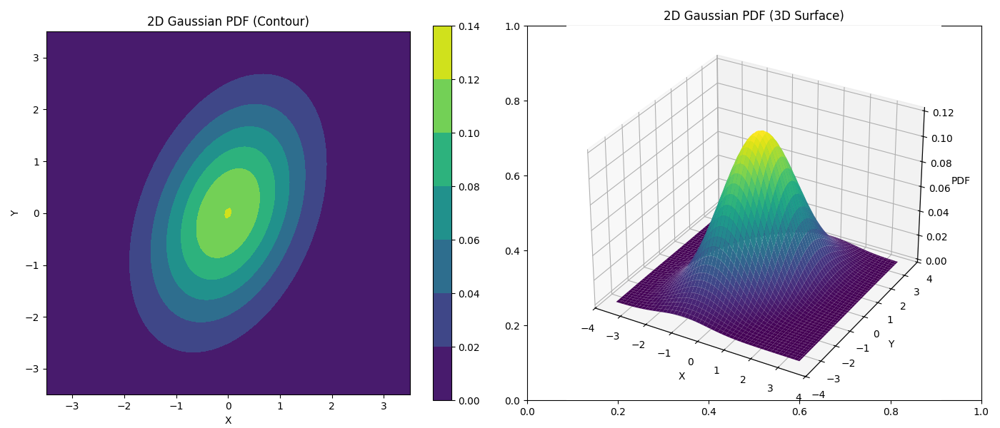

## 3. Probability Theory

- [3. Probability Theory](#3-probability-theory)
    - [a. Probability Space $(\\Omega, \\mathcal{F}, P)$](#a-probability-space-omega-mathcalf-p)
    - [b. Random Variables (RV)](#b-random-variables-rv)
    - [c. Cumulative Distribution Function (CDF)](#c-cumulative-distribution-function-cdf)
    - [d. Probability Mass Function (PMF) (for Discrete RVs)](#d-probability-mass-function-pmf-for-discrete-rvs)
    - [e. Probability Density Function (PDF) (for Continuous RVs)](#e-probability-density-function-pdf-for-continuous-rvs)
    - [f. Expected Value, Variance, Covariance](#f-expected-value-variance-covariance)
    - [g. Joint, Marginal, and Conditional Distributions](#g-joint-marginal-and-conditional-distributions)
      - [1. Joint Distributions](#1-joint-distributions)
      - [2. Marginal Distributions](#2-marginal-distributions)
      - [3. Conditional Distributions](#3-conditional-distributions)
    - [h. Independence and Conditional Independence of Random Variables](#h-independence-and-conditional-independence-of-random-variables)
    - [i. Limit Theorems: The Law of Large Numbers (LLN) and Central Limit Theorem (CLT)](#i-limit-theorems-the-law-of-large-numbers-lln-and-central-limit-theorem-clt)
      - [1. The Law of Large Numbers (LLN)](#1-the-law-of-large-numbers-lln)
      - [2. The Central Limit Theorem (CLT)](#2-the-central-limit-theorem-clt)
    - [j. Concentration Inequalities](#j-concentration-inequalities)
      - [1. Markov's Inequality](#1-markovs-inequality)
      - [2. Chebyshev's Inequality](#2-chebyshevs-inequality)
      - [3. Hoeffding's Inequality](#3-hoeffdings-inequality)
      - [4. (Briefly) Other Important Inequalities](#4-briefly-other-important-inequalities)

**Concept:** The mathematical framework for <u>quantifying uncertainty and randomness</u>. In its modern, axiomatic formulation, <u>probability is a type of measure</u>.

**Why it's important for ML/DL:**
- **Modeling Uncertainty:** Data is often <u>noisy</u> and processes are <u>inherently stochastic</u>.
- **Generative Models:** Models that <u>learn the probability distribution of the input data</u> (e.g., GANs, VAEs).
- **Loss Functions:** Many loss functions are derived from <u>probabilistic principles</u> (e.g., cross-entropy from likelihood).
- **Bayesian Methods:** Probabilistic approach to inference and learning.
- **Regularization:** Can sometimes be interpreted as imposing prior beliefs on parameters.

#### a. Probability Space $(\Omega, \mathcal{F}, P)$

At the heart of probability theory is the **probability space**, a mathematical construct that models a random process. It consists of three components:

1. **Sample Space ($\Omega$)**:
   - **Definition:** The set of **all possible outcomes** of a random experiment.
   - **Examples:**
     - Coin flip: $\Omega = \{H, T\}$
     - Dice roll: $\Omega = \{1, 2, 3, 4, 5, 6\}$
     - Height of a randomly selected person: $\Omega = (0, \infty)$ (a range of real numbers)
     - Sequence of 10 coin flips: $\Omega = \{ (s_1, s_2, ..., s_{10}) : s_i \in \{H,T\} \}$ (contains $2^{10}$ outcomes)

2.  **Event Space ($\mathcal{F}$ or Sigma-Algebra)**:
    - **Definition:** A collection of subsets of $\Omega$ (called *events*) to which we can assign probabilities. **Not every subset of $\Omega$ is necessarily an event if $\Omega$ is uncountable**, due to technical mathematical reasons (e.g., to avoid paradoxes like the Banach-Tarski paradox).
    - $\mathcal{F}$ must be a **$\sigma$-algebra** (or $\sigma$-field), satisfying:
      1.  $\Omega \in \mathcal{F}$ (The sample space itself is an event – something must happen).
      2.  If $A \in \mathcal{F}$, then $A^c \in \mathcal{F}$ (If $A$ is an event, its complement "not A" is also an event. It's closed under complementation).
      3.  If $A_1, A_2, \dots \in \mathcal{F}$ (a countable sequence of events), then $\bigcup_{i=1}^{\infty} A_i \in \mathcal{F}$ (The union of a countable number of events is also an event. It's closed under countable unions).
    - **Implications:** These properties also mean $\mathcal{F}$ is closed under countable intersections, set differences, and contains the empty set $\emptyset$.
    - **Events:** An event is a subset of $\Omega$ for which we can ask "what is its probability?".
      - Example (Dice roll): $\Omega = \{1,2,3,4,5,6\}$.
        - Event "getting an even number": $A = \{2,4,6\}$.
        - Event "getting a number > 3": $B = \{4,5,6\}$.
        - $A \cup B = \{2,4,5,6\}$ (even or >3) is also an event.
        - $A \cap B = \{4,6\}$ (even and >3) is also an event.

3.  **Probability Measure ($P$)**:
    - **Definition:** **A function** $P: \mathcal{F} \to [0, 1]$ that assigns a probability (a real number between 0 and 1) to each event in $\mathcal{F}$. It must satisfy the **Kolmogorov Axioms**:
      1.  **Non-negativity:** For any event $A \in \mathcal{F}$, $P(A) \ge 0$.
      2.  **Normalization (Unit Measure):** $P(\Omega) = 1$ (The probability that *some* outcome in the sample space occurs is 1).
      3.  **Countable Additivity (or $\sigma$-additivity):** For any countable sequence of *disjoint* events $A_1, A_2, \dots \in \mathcal{F}$ (i.e., $A_i \cap A_j = \emptyset$ for $i \neq j$),
        
        $$
        P\left(\bigcup_{i=1}^{\infty} A_i\right) = \sum_{i=1}^{\infty} P(A_i)
        $$

        (The probability of the union of disjoint events is the sum of their individual probabilities).

**The Triplet:** The combination $(\Omega, \mathcal{F}, P)$ is called a probability space. This rigorous framework allows us to consistently define and work with probabilities.

---

#### b. Random Variables (RV)

- **Intuition (Recap):** A random variable assigns a numerical value to each possible outcome of a random experiment.
    - Example (Two coin flips): $\Omega = \{HH, HT, TH, TT\}$.
        - Let $X$ be the "number of heads".
        - $X(HH) = 2, X(HT) = 1, X(TH) = 1, X(TT) = 0$.
        - The range of $X$ is $\{0, 1, 2\}$.

- **Borel $\sigma$-algebra on $\mathbb{R}$ (denoted $\mathcal{B}(\mathbb{R})$):**
    - Before formally defining a random variable, we need the concept of the **Borel $\sigma$-algebra** on the real numbers $\mathbb{R}$.
    - This is the $\sigma$-algebra generated by all open intervals $(a,b)$ in $\mathbb{R}$. Equivalently, it can be generated by all intervals of the form $(-\infty, x]$ for $x \in \mathbb{R}$.
    - $\mathcal{B}(\mathbb{R})$ contains all sets in $\mathbb{R}$ that you can form starting from intervals through countable unions, countable intersections, and complements. This includes open sets, closed sets, individual points, countable sets, etc. <span style='color:red'>Essentially, any "reasonable" subset of $\mathbb{R}$ is a Borel set.</span>

- **Formal Definition of a Real-Valued Random Variable:**
    - Given a probability space $(\Omega, \mathcal{F}, P)$, a **real-valued random variable** $X$ is a function $X: \Omega \to \mathbb{R}$ such that for every Borel set $B \in \mathcal{B}(\mathbb{R})$, the pre-image of $B$ under $X$ is an event in $\mathcal{F}$.
    - That is, $X^{-1}(B) = \{\omega \in \Omega : X(\omega) \in B\} \in \mathcal{F}$ for all $B \in \mathcal{B}(\mathbb{R})$.
    - This property is called **measurability** (specifically, $X$ is $\mathcal{F}/\mathcal{B}(\mathbb{R})$-measurable).

- **Significance of Measurability & Connection to $P(X \le x)$:**
    - The condition that $X^{-1}(B) \in \mathcal{F}$ for all Borel sets $B$ <span style='color:red'>ensures that we can assign probabilities to statements about $X$</span>. For example, "What is the probability that $X$ falls into the interval $[a,b]$?" The set $[a,b]$ is a Borel set, so $\{\omega \in \Omega : X(\omega) \in [a,b]\}$ <u>is an event in</u> $\mathcal{F}$, and thus $P(\{\omega \in \Omega : X(\omega) \in [a,b]\})$ is well-defined.
    - A crucial simplification (and an equivalent condition for measurability) is to check this property only for the ***generators*** of the Borel $\sigma$-algebra. Since intervals of the form $(-\infty, x]$ generate $\mathcal{B}(\mathbb{R})$, $X$ is a random variable if and only if:
        For every $x \in \mathbb{R}$, the set $\{\omega \in \Omega : X(\omega) \le x\}$ is an event in $\mathcal{F}$.
        (i.e., $X^{-1}((-\infty, x]) \in \mathcal{F}$ for all $x \in \mathbb{R}$).
    - This is precisely why we can define the Cumulative Distribution Function (CDF) as $F_X(x) = P(X \le x)$, because the set $\{\omega : X(\omega) \le x\}$ is guaranteed to be an event in $\mathcal{F}$ to which the probability measure $P$ can be applied.

- **In summary:** A random variable is a function that translates outcomes from our original sample space $\Omega$ into real numbers, <span style='color:lightblue'>in such a way that we can meaningfully ask and answer probability questions about those real numbers</span> (e.g., "What's the probability $X$ is less than 5?"). The "measurability" condition ensures this is always possible for any reasonable question we might ask about the values $X$ takes.

- **Types of Random Variables:**
    - **Discrete Random Variable:** Takes on a finite or countably infinite number of distinct values. (The range of $X$ is a countable set).
    - **Continuous Random Variable:** Can take on any value within a continuous interval (or union of intervals). (Typically, its CDF is continuous).

**Implementation Note:**
- In NumPy/PyTorch, we usually work directly with the *realizations* (observed values) of random variables, or with objects that represent their distributions. **The underlying mapping from $\Omega$ and the measurability condition are foundational assumptions that make these libraries work consistently**.

---

#### c. Cumulative Distribution Function (CDF)

- **Definition:** For any random variable $X$, its **Cumulative Distribution Function (CDF)**, denoted $F_X(x)$ (or simply $F(x)$), is defined as:
    $F_X(x) = P(X \le x) = P(\{\omega \in \Omega : X(\omega) \le x\})$
    The CDF gives the probability that the random variable $X$ takes on a value less than or equal to $x$.
- **Properties of a CDF:**
    1.  **Non-decreasing:** If $a < b$, then $F_X(a) \le F_X(b)$.
    2.  **Limits:**
        - $\lim_{x \to -\infty} F_X(x) = 0$
        - $\lim_{x \to +\infty} F_X(x) = 1$
    3.  **Right-continuous:** $\lim_{h \to 0^+} F_X(x+h) = F_X(x)$.
- The CDF uniquely defines the distribution of a random variable.
- $P(a < X \le b) = F_X(b) - F_X(a)$ for $a < b$.


---

#### d. Probability Mass Function (PMF) (for Discrete RVs)

- **Definition:** For a **discrete random variable** $X$ that takes values in a countable set $S = \{x_1, x_2, \dots\}$, its **Probability Mass Function (PMF)**, denoted $p_X(x)$ (or $p(x)$), is defined as:
    $p_X(x) = P(X=x)$
- The PMF gives the probability that the discrete random variable $X$ is exactly equal to the value $x$.
- **Properties of a PMF:**
    1.  $p_X(x) \ge 0$ for all $x \in S$.
    2.  $p_X(x) = 0$ if $x \notin S$.
    3.  $\sum_{x \in S} p_X(x) = 1$ (The sum of probabilities over all possible values is 1).
- **Relationship with CDF:** $F_X(x) = \sum_{k \le x, k \in S} p_X(k)$. And $p_X(x) = F_X(x) - \lim_{\epsilon \to 0^+} F_X(x-\epsilon)$.

**Common Discrete Distributions & their PMFs:**
- **Bernoulli($p$):** $X \in \{0,1\}$. $p_X(1) = p$, $p_X(0) = 1-p$.
- **Binomial($n, p$):** $X \in \{0,1,\dots,n\}$. $p_X(k) = \binom{n}{k} p^k (1-p)^{n-k}$.
- **Categorical($p_1, \dots, p_K$):** $X \in \{1,\dots,K\}$. $p_X(k) = p_k$.
- **Poisson($\lambda$):** $X \in \{0,1,\dots\}$. $p_X(k) = \frac{\lambda^k e^{-\lambda}}{k!}$.


---

#### e. Probability Density Function (PDF) (for Continuous RVs)

- **Definition:** For a **continuous random variable** $X$, its **Probability Density Function (PDF)**, denoted $f_X(x)$ (or $f(x)$), is a function such that its CDF can be expressed as:
    $F_X(x) = \int_{-\infty}^x f_X(t) dt$
- This implies that where $F_X(x)$ is differentiable, $f_X(x) = \frac{dF_X(x)}{dx}$.
- **Important Note:** For a continuous RV, $f_X(x)$ is *not* the probability that $X=x$. In fact, $P(X=x) = 0$ for any specific value $x$.
    - The PDF represents density: $P(x < X \le x+dx) \approx f_X(x) dx$ for small $dx$.
- Probabilities are obtained by integrating the PDF over an interval:
    $P(a < X \le b) = \int_a^b f_X(x) dx = F_X(b) - F_X(a)$.
- **Properties of a PDF:**
    1.  $f_X(x) \ge 0$ for all $x$. (Unlike PMF, PDF values can be > 1, e.g., Uniform(0, 0.1) has $f(x)=10$).
    2.  $\int_{-\infty}^{\infty} f_X(x) dx = 1$ (The total area under the PDF curve is 1).

**Common Continuous Distributions & their PDFs:**
- **Uniform($a, b$):** $f_X(x) = \frac{1}{b-a}$ for $a \le x \le b$, and 0 otherwise.
- **Normal/Gaussian($\mu, \sigma^2$):** $f_X(x) = \frac{1}{\sigma\sqrt{2\pi}} \exp\left(-\frac{(x-\mu)^2}{2\sigma^2}\right)$.
- **Multivariate Normal($\mu, \Sigma$):** $f_X(x) = \frac{1}{(2\pi)^{k/2} |\Sigma|^{1/2}} \exp\left(-\frac{1}{2} (x - \mu)^T \Sigma^{-1} (x - \mu)\right)$, where $k$ is the dimension of $x$.
- **Gamma($\alpha, \beta$):** $f_X(x) = \frac{\beta^\alpha}{\Gamma(\alpha)} x^{\alpha-1} e^{-\beta x}$ for $x \ge 0$, and 0 otherwise.


---

#### f. Expected Value, Variance, Covariance

With the formal definitions of RVs, PMFs, and PDFs, we can define these concepts more rigorously.

- **Expected Value (Mean, $E[X]$ or $\mu_X$):**
    The expectation of a function $g(X)$ of a random variable $X$ is:
    - For discrete $X$: $E[g(X)] = \sum_{x \in S} g(x) p_X(x)$
    - For continuous $X$: $E[g(X)] = \int_{-\infty}^{\infty} g(x) f_X(x) dx$
    The mean is $E[X]$ (where $g(X)=X$).
- **Variance ($Var(X)$ or $\sigma_X^2$):**
    $Var(X) = E[(X - E[X])^2] = E[X^2] - (E[X])^2$.
    The standard deviation is $\sigma_X = \sqrt{Var(X)}$.
- **Covariance ($Cov(X, Y)$):** For two random variables $X$ and $Y$:
    $Cov(X, Y) = E[(X - E[X])(Y - E[Y])] = E[XY] - E[X]E[Y]$.
    Requires the concept of a *joint distribution* $p_{X,Y}(x,y)$ or $f_{X,Y}(x,y)$.
    $E[XY] = \sum_x \sum_y xy \cdot p_{X,Y}(x,y)$ or $\iint xy \cdot f_{X,Y}(x,y) dx dy$.
- **Correlation ($\rho_{XY}$):** Remains $Corr(X, Y) = \frac{Cov(X, Y)}{\sigma_X \sigma_Y}$.

**Implementation:** The NumPy/PyTorch implementations shown previously for calculating sample means, variances, etc., are empirical estimates of these theoretical quantities. `torch.distributions` objects often have `.mean` and `.variance` properties that give the theoretical values if known.

```python
normal_dist_pt = dist.Normal(torch.tensor(5.0), torch.tensor(2.0)) # mu=5, sigma=2
print(f"Theoretical mean of N(5, 4): {normal_dist_pt.mean}")
print(f"Theoretical variance of N(5, 4): {normal_dist_pt.variance}") # variance = sigma^2 = 4
print(f"Theoretical stddev of N(5, 4): {normal_dist_pt.stddev}")
```

---

#### g. Joint, Marginal, and Conditional Distributions

So far, we've focused on single random variables. However, in most real-world scenarios and machine learning problems, we deal with **multiple random variables** simultaneously. We need tools to describe their collective behavior and interdependencies.

##### 1. Joint Distributions

- **Concept:** A joint distribution describes the probability of two or more random variables taking on specific values or falling into specific ranges *simultaneously*.
- **Joint Cumulative Distribution Function (Joint CDF):**
    For two random variables $X$ and $Y$, their joint CDF is:
    $F_{X,Y}(x,y) = P(X \le x, Y \le y)$
    This generalizes to $n$ variables $X_1, \dots, X_n$: $F_{X_1, \dots, X_n}(x_1, \dots, x_n) = P(X_1 \le x_1, \dots, X_n \le x_n)$.

- **Joint Probability Mass Function (Joint PMF):**
    For two **discrete** random variables $X$ and $Y$, their joint PMF is:
    $p_{X,Y}(x,y) = P(X=x, Y=y)$
    **Properties:**
    1.  $p_{X,Y}(x,y) \ge 0$ for all $x, y$.
    2.  $\sum_x \sum_y p_{X,Y}(x,y) = 1$.

- **Joint Probability Density Function (Joint PDF):**
    For two **continuous** random variables $X$ and $Y$, their joint PDF $f_{X,Y}(x,y)$ is a function such that:
    $P((X,Y) \in A) = \iint_A f_{X,Y}(x,y) dx dy$ for any region $A \in \mathbb{R}^2$.
    The joint CDF can be obtained by: $F_{X,Y}(x,y) = \int_{-\infty}^x \int_{-\infty}^y f_{X,Y}(u,v) dv du$.
    And, $f_{X,Y}(x,y) = \frac{\partial^2 F_{X,Y}(x,y)}{\partial x \partial y}$.
    **Properties:**
    1.  $f_{X,Y}(x,y) \ge 0$ for all $x, y$.
    2.  $\int_{-\infty}^{\infty} \int_{-\infty}^{\infty} f_{X,Y}(x,y) dx dy = 1$.



##### 2. Marginal Distributions

- **Concept:** Given a joint distribution of multiple random variables, the marginal distribution of a subset of these variables is obtained by "averaging out" or "summing/integrating out" the other variables. It tells us the probability distribution of one variable irrespective of the values of the others.
- **Marginal PMF (Discrete):**
    For discrete $X, Y$ with joint PMF $p_{X,Y}(x,y)$:
    The marginal PMF of $X$ is $p_X(x) = P(X=x) = \sum_y p_{X,Y}(x,y)$ (sum over all possible values of $Y$).
    The marginal PMF of $Y$ is $p_Y(y) = P(Y=y) = \sum_x p_{X,Y}(x,y)$ (sum over all possible values of $X$).
- **Marginal PDF (Continuous):**
    For continuous $X, Y$ with joint PDF $f_{X,Y}(x,y)$:
    The marginal PDF of $X$ is $f_X(x) = \int_{-\infty}^{\infty} f_{X,Y}(x,y) dy$.
    The marginal PDF of $Y$ is $f_Y(y) = \int_{-\infty}^{\infty} f_{X,Y}(x,y) dx$.


##### 3. Conditional Distributions

- **Concept:** A conditional distribution describes the probability distribution of one random variable *given* that another random variable has taken on a specific value. It formalizes how knowledge about one variable changes our beliefs about another.
- **Conditional PMF (Discrete):**
    The conditional PMF of $Y$ given $X=x$ is:
    $p_{Y|X}(y|x) = P(Y=y | X=x) = \frac{P(X=x, Y=y)}{P(X=x)} = \frac{p_{X,Y}(x,y)}{p_X(x)}$, provided $p_X(x) > 0$.
    For a fixed $x$, $p_{Y|X}(\cdot|x)$ is a valid PMF for $Y$.
- **Conditional PDF (Continuous):**
    The conditional PDF of $Y$ given $X=x$ is:
    $f_{Y|X}(y|x) = \frac{f_{X,Y}(x,y)}{f_X(x)}$, provided $f_X(x) > 0$.
    For a fixed $x$, $f_{Y|X}(\cdot|x)$ is a valid PDF for $Y$.

- **Chain Rule of Probability for Random Variables:**
    From the definition of conditional distributions, we get the chain rule:
    - Discrete: $p_{X,Y}(x,y) = p_{Y|X}(y|x) p_X(x) = p_{X|Y}(x|y) p_Y(y)$.
    - Continuous: $f_{X,Y}(x,y) = f_{Y|X}(y|x) f_X(x) = f_{X|Y}(x|y) f_Y(y)$.
    This generalizes to more variables: $f(x_1, \dots, x_n) = f(x_n|x_1, \dots, x_{n-1}) f(x_{n-1}|x_1, \dots, x_{n-2}) \dots f(x_2|x_1) f(x_1)$.
    This decomposition is fundamental to probabilistic graphical models (e.g., Bayesian Networks).


---

#### h. Independence and Conditional Independence of Random Variables

With joint distributions defined, we can be more precise about independence.

- **Independence of Random Variables:**
    Two random variables $X$ and $Y$ are **independent** if and only if their joint distribution factors into the product of their marginal distributions:
    - Discrete: $p_{X,Y}(x,y) = p_X(x) p_Y(y)$ for all $x,y$.
    - Continuous: $f_{X,Y}(x,y) = f_X(x) f_Y(y)$ for all $x,y$.
    Equivalently, this means that <u>knowing the value of one variable provides no information about the other</u>:
    - $p_{Y|X}(y|x) = p_Y(y)$ (if $p_X(x)>0$)
    - $f_{Y|X}(y|x) = f_Y(y)$ (if $f_X(x)>0$)
    For $n$ random variables $X_1, \dots, X_n$, they are mutually independent if $f(x_1, \dots, x_n) = f_1(x_1) \dots f_n(x_n)$.
    - If $X,Y$ are independent, then $E[g(X)h(Y)] = E[g(X)]E[h(Y)]$. This implies $Cov(X,Y)=0$. (Converse: $Cov(X,Y)=0$ does *not* always imply independence, unless e.g., $X,Y$ are jointly Normal).

- **Conditional Independence of Random Variables:**
    Random variables $X$ and $Y$ are **conditionally independent given $Z$** if their joint conditional distribution (given $Z$) factors into the product of their individual conditional distributions (given $Z$):
    - $f_{X,Y|Z}(x,y|z) = f_{X|Z}(x|z) f_{Y|Z}(y|z)$ for all $x,y,z$ (continuous case, similar for discrete).
    Equivalently, $f_{X|Y,Z}(x|y,z) = f_{X|Z}(x|z)$. Given $Z$, learning $Y$ provides no additional information about $X$.
    This is often written as $X \perp Y | Z$.
    Conditional independence is a cornerstone of probabilistic graphical models, allowing complex distributions to be represented by simpler local relationships. The Naive Bayes classifier, for example, assumes features are conditionally independent given the class label.

---

#### i. Limit Theorems: The Law of Large Numbers (LLN) and Central Limit Theorem (CLT)

Limit theorems describe the long-term behavior of sequences of random variables. Two of the most important are the Law of Large Numbers and the Central Limit Theorem. They provide a bridge between theoretical probability and practical statistics, explaining why empirical averages converge to true expectations and why the Normal distribution is so ubiquitous.

##### 1. The Law of Large Numbers (LLN)

- **Concept:** The LLN states that the average of the results obtained from a large number of independent and identically distributed (i.i.d.) random trials will tend to get closer to the **true expected value** of a single trial as more trials are performed.
- **Intuition:** If you flip a fair coin many times, the proportion of heads you observe will likely be very close to 0.5. The more you flip, the closer you expect this proportion to get. The sample mean "settles down" to the true population mean.
- **Formal Statements (Two main forms):**
    Let $X_1, X_2, \dots, X_n$ be a sequence of i.i.d. random variables with a finite expected value $E[X_i] = \mu$. Let $\bar{X}_n = \frac{1}{n}\sum_{i=1}^n X_i$ be the sample mean.

    - **Weak Law of Large Numbers (WLLN):**
        For any $\epsilon > 0$,
        $$ \lim_{n \to \infty} P(|\bar{X}_n - \mu| < \epsilon) = 1 $$
        This means that for a sufficiently large $n$, the sample mean $\bar{X}_n$ is likely to be very close to the true mean $\mu$. It describes convergence *in probability*.

    - **Strong Law of Large Numbers (SLLN):**
        $$ P\left(\lim_{n \to \infty} \bar{X}_n = \mu\right) = 1 $$
        This is a stronger statement, implying that $\bar{X}_n$ converges to $\mu$ *almost surely* (i.e., with probability 1). For almost every sequence of outcomes, the sample mean will eventually converge to the true mean.

- **Why it's important for ML/DL & Statistics:**
    - **Justification for Monte Carlo Methods:** Many complex integrals or expectations are estimated by simulating random samples and taking their average. The LLN guarantees that this average converges to the true value. (e.g., estimating expected reward in reinforcement learning, approximating posterior distributions in Bayesian inference via MCMC).
    - **Foundation of Parameter Estimation:** When we use a sample mean to estimate a population mean (like in MLE for Gaussian mean), the LLN tells us that with enough data, our estimate will be close to the true parameter.
    - **Empirical Risk Minimization:** In supervised learning, we often minimize the average loss over a training set (empirical risk). The LLN suggests that, under certain conditions, this empirical risk will converge to the true expected risk (generalization error) as the training set size grows.
    - **Stability of Frequencies:** The observed frequency of an event in many trials approximates its true probability.


##### 2. The Central Limit Theorem (CLT)

- **Concept:** The CLT is a remarkable result stating that, under certain (often mild) conditions, the sum (or average) of a large number of independent random variables, each with finite mean and variance, will be approximately **Normally distributed (Gaussian)**, *regardless of the original distribution of the individual variables*.
- **Intuition:** Many real-world phenomena result from the sum of numerous small, independent effects. The CLT explains why the Normal distribution appears so frequently in nature and in data (e.g., measurement errors, heights of people).
- **Formal Statement (Lindeberg-Lévy CLT, common version):**
    Let $X_1, X_2, \dots, X_n$ be a sequence of i.i.d. random variables with finite expected value $E[X_i] = \mu$ and finite non-zero variance $Var(X_i) = \sigma^2$.
    Let $S_n = \sum_{i=1}^n X_i$ be the sum, and $\bar{X}_n = \frac{S_n}{n}$ be the sample mean.
    Then, the standardized sum (or standardized mean) converges in distribution to a standard Normal distribution $N(0,1)$ as $n \to \infty$:
    $$ Z_n = \frac{S_n - n\mu}{\sigma\sqrt{n}} = \frac{\bar{X}_n - \mu}{\sigma/\sqrt{n}} \xrightarrow{d} N(0,1) $$
    This means for large $n$:
    - The sum $S_n$ is approximately $N(n\mu, n\sigma^2)$.
    - The sample mean $\bar{X}_n$ is approximately $N(\mu, \sigma^2/n)$.

- **Why it's important for ML/DL & Statistics:**
    - **Foundation for Hypothesis Testing and Confidence Intervals:** Many statistical tests (like t-tests, z-tests) and methods for constructing confidence intervals for means rely on the (approximate) Normality of sample means, even if the underlying data is not Normal.
    - **Understanding Sampling Distributions:** The CLT tells us that the sampling distribution of the sample mean (and many other estimators) tends to be Normal for large samples. This is crucial for making inferences about population parameters.
    - **Approximations:** Can be used to approximate probabilities for sums/averages from non-Normal distributions (e.g., Binomial distribution can be approximated by Normal for large $n$).
    - **Model Assumptions:** In some ML models (like Linear Regression), assumptions about Normally distributed errors are made. The CLT provides some justification if errors are thought to be sums of many small unobserved factors.
    - **Weight Initialization in NNs:** Some initialization schemes (like Xavier/He) are designed assuming activations/gradients behave somewhat Normally, partly due to CLT-like effects from summing many weighted inputs.

Simulate taking the average of $k$ dice rolls (which are Uniformly distributed) many times. The distribution of these averages should look Normal for large $k$.


---

Excellent point! Concentration inequalities are extremely important, especially in statistical learning theory for proving generalization bounds and understanding how quickly empirical quantities concentrate around their true expectations. They provide non-asymptotic bounds, which can be more useful than asymptotic results like LLN/CLT for finite sample sizes.

Here's a section on some key concentration inequalities. This could go after LLN/CLT, as they provide finite-sample guarantees that complement the asymptotic nature of LLN/CLT.

---

**(Insert this after "i. Limit Theorems: The Law of Large Numbers (LLN) and Central Limit Theorem (CLT)")**

---

#### j. Concentration Inequalities

While the Law of Large Numbers tells us that sample averages converge to their expected values, and the Central Limit Theorem describes the limiting distribution, **concentration inequalities** provide explicit, **non-asymptotic bounds** on the probability that a sum (or average) of random variables deviates from its expectation by a certain amount. These are crucial for <span style='color:red'>understanding the behavior of estimators with finite samples and for deriving generalization bounds in machine learning.</span>

##### 1. Markov's Inequality

- **Statement:** For any **non-negative** random variable $X$ and any $a > 0$:
    $$ P(X \ge a) \le \frac{E[X]}{a} $$
- **Intuition:** If a non-negative random variable has a small mean, it's unlikely to take on a very large value. The probability of $X$ being at least $a$ is bounded by how many "units of $a$" fit into its mean.
- **Requirements:** $X \ge 0$.
- **Strength:** Very general (requires only non-negativity and finite mean), but often gives a loose bound.
- **Use:** Primarily a theoretical tool used to prove other inequalities (like Chebyshev's).
- **Extended version for nondecreasing functions:** 
    If $\varphi$ is a nondecreasing nonnegative function, $X$ is a (not necessarily nonnegative) random variable, and $\varphi(a) > 0$, then

    $$\mathbb{P}(X \geq a) \leq \frac{\mathbb{E}(\varphi(X))}{\varphi(a)}.$$

    An immediate corollary, using higher moments of $X$ supported on values larger than 0, is

    $$\mathbb{P}(|X| \geq a) \leq \frac{\mathbb{E}(|X|^n)}{a^n}.$$

##### 2. Chebyshev's Inequality

- **Statement:** For any random variable $X$ with finite mean $\mu = E[X]$ and finite non-zero variance $\sigma^2 = Var(X)$, and for any $k > 0$:
    $$ P(|X - \mu| \ge k\sigma) \le \frac{1}{k^2} $$
    Alternatively, for any $\epsilon > 0$ (letting $\epsilon = k\sigma$):
    $$ P(|X - \mu| \ge \epsilon) \le \frac{\sigma^2}{\epsilon^2} $$
- **Intuition:** The probability that a random variable deviates from its mean by more than $k$ standard deviations is small (at most $1/k^2$). It quantifies the idea that values far from the mean are less likely if the variance is small.
- **Requirements:** Finite mean and variance.
- **Strength:** Stronger than Markov's (uses variance), but still can be loose. Applies to any distribution with finite mean/variance.
- **Use:**
    - Provides a way to bound deviations without knowing the specific distribution.
    - Used to prove the Weak Law of Large Numbers.
    - Example: The probability of a random variable being more than 2 standard deviations away from its mean is at most $1/2^2 = 0.25$. For 3 standard deviations, at most $1/3^2 \approx 0.11$. (Compare to Normal distribution's $\approx 0.05$ and $\approx 0.003$ respectively; Chebyshev is more general but looser).

**Derivation of Chebyshev from Markov:**
Let $Y = (X-\mu)^2$. $Y$ is non-negative. $E[Y] = E[(X-\mu)^2] = \sigma^2$.
$P(|X-\mu| \ge \epsilon) = P((X-\mu)^2 \ge \epsilon^2)$.
Apply Markov's inequality to $Y$ with $a = \epsilon^2$:
$P(Y \ge \epsilon^2) \le \frac{E[Y]}{\epsilon^2} = \frac{\sigma^2}{\epsilon^2}$.

##### 3. Hoeffding's Inequality

- **Statement:** Provides a tighter bound for sums of **bounded** independent random variables.
    Let $X_1, \dots, X_n$ be independent random variables such that $a_i \le X_i \le b_i$ for all $i$ (i.e., $X_i$ is bounded in the interval $[a_i, b_i]$). Let $S_n = \sum_{i=1}^n X_i$. Then for any $t > 0$:
    $$ P(S_n - E[S_n] \ge t) \le \exp\left(-\frac{2t^2}{\sum_{i=1}^n (b_i - a_i)^2}\right) $$
    And for the sample mean $\bar{X}_n = S_n/n$:
    $$ P(\bar{X}_n - E[\bar{X}_n] \ge \epsilon) \le \exp\left(-\frac{2n\epsilon^2}{\frac{1}{n}\sum_{i=1}^n (b_i - a_i)^2}\right) $$
    If all $X_i$ are i.i.d. and bounded in $[a,b]$ (so $b_i-a_i = B = b-a$ for all $i$):
    $$ P(\bar{X}_n - \mu \ge \epsilon) \le \exp\left(-\frac{2n\epsilon^2}{B^2}\right) $$
    And by symmetry for the two-sided bound:
    $$ P(|\bar{X}_n - \mu| \ge \epsilon) \le 2\exp\left(-\frac{2n\epsilon^2}{B^2}\right) $$
- **Intuition:** The probability that the sample mean deviates significantly from the true mean decreases exponentially with the number of samples $n$ and with the square of the deviation $\epsilon$. The bound depends on the range of the variables.
- **Requirements:** Independent random variables, bounded range for each.
- **Strength:** Often much tighter than Chebyshev's for bounded variables, especially for tail probabilities. Gives exponential decay.
- **Why it's important for ML/DL:**
    - **Generalization Bounds:** Crucial in statistical learning theory (e.g., PAC learning). If the loss function is bounded (e.g., 0-1 loss in classification), Hoeffding's inequality can be used to bound the probability that the empirical error (on training set) differs from the true error (generalization error) by more than $\epsilon$.
        $P(|\text{EmpiricalRisk} - \text{TrueRisk}| \ge \epsilon) \le 2\exp(-2n\epsilon^2 / B^2)$
        This shows that with enough samples ($n$), the empirical risk is likely close to the true risk.
    - **Analysis of Randomized Algorithms:** Used in analyzing algorithms that involve averaging bounded random quantities.

**Simplified Hoeffding for Bernoulli RVs (Common in ML):**
If $X_i \sim \text{Bernoulli}(p)$, then $X_i \in [0,1]$, so $B=1$.
Let $\hat{p} = \bar{X}_n$ be the sample proportion. Then $\mu=p$.
$$ P(|\hat{p} - p| \ge \epsilon) \le 2\exp(-2n\epsilon^2) $$

##### 4. (Briefly) Other Important Inequalities

- **Chernoff Bounds:** Similar to Hoeffding's but often tighter, particularly for sums of specific types of random variables (like Bernoulli). They are derived using the moment generating function (MGF) and Markov's inequality applied to $e^{sX}$.
- **Bernstein's Inequality:** Provides tighter bounds than Hoeffding's when the variance of the random variables is small compared to their range. It incorporates variance information.
- **McDiarmid's Inequality (Bounded Differences Inequality):** Generalizes Hoeffding's to functions of many independent random variables, where changing one variable doesn't change the function's value too much (bounded differences property). Very powerful for analyzing complex statistics or outputs of randomized algorithms.

**Why Concentration Inequalities Matter for ML Theory:**
These inequalities are the workhorses for proving that machine learning algorithms generalize well. They allow us to make statements like:
"With probability at least $1-\delta$, the true error of our learned hypothesis $h$ is no more than its training error plus some term that depends on $\epsilon$, $n$, $\delta$, and the complexity of the hypothesis class."
$\epsilon$ here is often related to the "generalization gap" allowed.
They form the basis for understanding how much data is needed to achieve a certain level of confidence in our model's performance on unseen data.